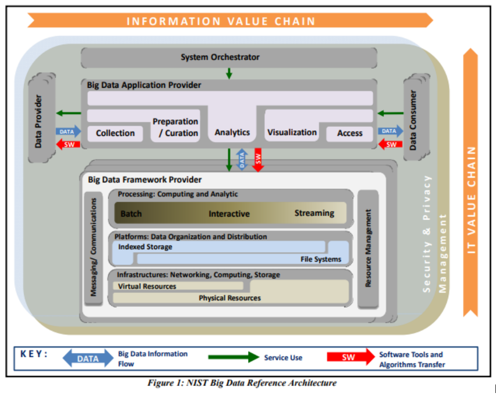
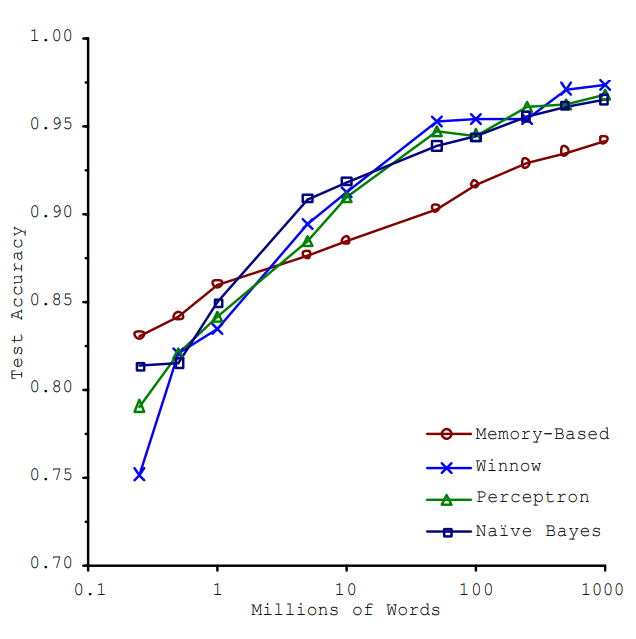

# Big Data Engineering

## About

This is a pretty neat subject matter. It's all about collecting, preparing and (perhaps) analyzing big data, as defined by the [3 Vs](https://github.com/garthmortensen/data/blob/master/Big%20Data/Engineering/notes/01_Intro_to_Big_Data.md#three-vs-of-big-data).

The NIST reference architecture is a good place to look at the overall big data architecture to better understand what's going on.

One of the neat ideas here is that learning algorithms become more performant with more data. That means if you can use a big data pipeline to flow enough data into your model, you can achieve better learning, (as seen with NLP at MS Research).

## Tools

Tools explored in this Big Data Engineering folder include:

- HDFS/MapReduce - the foundational distributed storage and aggregation/compute tool.
- Oozie - for job orchestration.
- Sqoop - for loading relational sql rdb to hdfs and vice versa.
- Data Integration - not software, but a neat way to think about integrating data using concepts of *cohesion* and *coupling*, as well as *enterprise integration patterns*.
- NiFi - for data integration. plenty of connectors and transformers available via a Visio-like GUI.
- Kafka - a message broker for messaging in a publisher/subscriber pattern.
- Spark - for interactive queries, stream processing...
- Elasticsearch - for content search...

