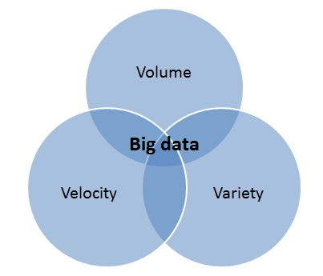
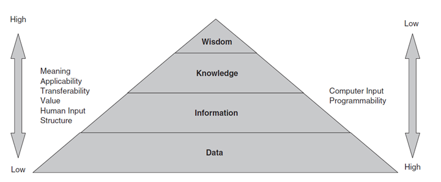

# Big Data Engineering

SEIS 736

Garth Mortensen

## Intro to Big Data

### Three V's of Big Data



#### Volume

The amount of data (bytes). How many TBs or PBs of info do you have to analyze and the technical challenges when working with data at that scale. Volume is by no means a necessary prerequisite to a data set, being considered, big data.

#### Variety

The degree of formal data structure ranging from structured (database schema) to semi-structured (JSON) to unstructured (full text).

##### Structure data

The amount of structure, typically in the data were structured data would be tabular data sets. Numeric values. Cleanly structured. Think of a RDB table. 

##### Semi-structured data

Also semi-structured data (JSON and XML). You might have key value pairs that are structured but there is no single schema for the data set. It's very easy to add an additional attribute to a JSON document. You don't need a predefined table like with SQL DDL.

##### Unstructured data

Unstructured data is typically categorized as full text data. 

All data is structured, to a certain extent. Even full text data sources can still organize text into paragraphs or words (tokens). So you can still derive some amount of structure from full text data and yet it is considered an unstructured data set. It's not traditional relational database or key value pairs that are easy for for computers to handle.

#### Velocity

How fast is the data being generated or consumed. 

IoT devices...you're talking about potentially monitoring systems or your vehicle or a manufacturing plant. It can generate readings every second or even multiple times per second. An e-commerce sites, with the number of interactions happening on amazon.com, not only in terms of me purchasing a product, but clicking on a product or navigating to a page or leaving a review. These are all generating interactions - a high amount of velocity. 

From a data ingestion perspective, new data points are coming in very fast. From that perspective, higher velocity data or data points that are generated more quickly over time. There's different levels of compute that we can use to deal with that data. **Batch compute** is your traditional scheduled jobs. Sort of taking new data points every hour for processing.

Or maybe a near real time system, or an event driven system that processes each data point. Streaming is not exactly the same as near real time or event driven processing. From a streaming perspective, you're taking windows of data and you're aggregating them.

##### Other Vs

Veracity, validity, volatility, plenty of Vs. The 3 key ones are the important ones.

### Definition of data and DIKW pyramid. (01:08:07)



This is a construct to reason about different levels of insight we can derive with data as a foundation. 

As we move up the pyramid, the different insights gained are harder to achieve and deal with programmatically. But they do increase in value. e.g., it's very easy to write algorithms to scrub data, derive information by aggregating that data. But AI programming is much more difficult.

#### Data

Data is facts. These are non-subjective pieces of information such as where you've been, what time you were there. Or IoT readings have a temperature at a point in time.

#### Information

Contained in descriptions, answers to questions that begin with such words as who, what, when and how many. Information strives to answer questions like who, what, when, how many and descriptive analytics. Past quarter sales? Most profitable customers?

#### Knowledge

A set of instructions that can be transmitted from one individual to another, or one machine to another. It's the understanding of systems and how they work, and being able to make assumptions. Predictive Analytics would likely fall into this category.

Reasoning about a system and predicting going forward.

#### Wisdom

Very non-tangible thing. In this case, the AI. This would be sort of insights gained over time from experience. Wisdom in the DIKW hierarchy/pyramid is most closely related to the AI algorithms, the sort of hard to explain, black box type judgments that are created from experience.

### Scale out vs scale up (horizontal and vertical scaling)


It's better to spread data out over smaller machines because you benefit from resiliency. A single node is a single point of failure. It's easier to add a node to a cluster than add resources to an existing node. Software is easier to manage on smaller systems, especially with Java applications, memory management within a JVM. Easier to manage a smaller 4 Gb JVM, bc less time garbage collecting, doing memory management. Scaling out is cost effective. Better for distribution of compute and storage.

Scale up mean giving all resources to one machine. Scale out means adding more machines.

You can't scale up forever. OS limitations, address spaces. File descriptors on a Linux machine are limited. How many connections can be opened. Scaling out dodges these.

However, on scaling out, if node 7 failed, the rest of the cluster must communicate and respond. There is resource locking across machines like an ACID transaction on RDB. 

### Definition of Big Data Architecture

> The software architecture for a scalable system suitable for “efficient storage, manipulation, and analysis” of datasets characterized by their relatively high “volume, [velocity], variety, and/or variability”.

NIST Big Data Interoperability Framework: Volume 1, Definitions. June 2018

### Big Data Enablers - Moore's law, hardware, web, IoT, etc.

Computer hardware improvements. Compute, storage, memory, more internet connectivity, massively scalable software.

[Moore's law](https://en.wikipedia.org/wiki/Moore's_law) is about component density. 

> ...the observation that [the number](https://en.wikipedia.org/wiki/Transistor_count) of [transistors](https://en.wikipedia.org/wiki/Transistor) in a dense [integrated circuit](https://en.wikipedia.org/wiki/Integrated_circuit) (IC) doubles about every two years.


### Origins of Hadoop: GFS/MapReduce/BigTable, HDFS/Hadoop MR/HBase

Microsoft Research was analyzing billions of words for NLP models. Google was indexing and searching the web. And, not only the need to to organize the web, but also data's increased value, considering the new AI algorithms for processing that data.

#### Google File System

In 2003, Google File System. It was a distributed file system that scaled to hundreds of terabytes and thousands of drives. It processed data in fixed-sized ‘chunks’ stored on Linux file systems (similar to block size). Used a custom interface (non-POSIX). POSIX is a portable operating system. Provided data replication and fault tolerance. Runs on commodity hardware, so you didn't need data replication at hardware level, no RAID. Just a bunch of disks and the software. 

It was able to scale out across commodity hardware.

We now have a place where we can store and access data on this file system stored in chunks right stored on Linux operating system. Think about it as a distributed cluster of Linux machines, all with their own disks their own attached storage. 

You don't just look at a single Linux machine a single operating system when accessing a file. You're now looking across Linux machines. It's the same file system you know and love. You can write files, read files, delete files. But, behind the scenes, software is managing a distributed file system across Linux machines. 

#### Map Reduce

2005 - when Google stores the data, they have that foundational file system to build off. But they now need a paradigm for processing that data efficiently again leveraging that distributed cluster. In this case it's MapReduce.

Two parts to this paradigm. 


##### Map

Taking each item in a distributed set, and calling the same function on it over and over. Maybe you have 1,000 records in a data center. You map those on 1,000 different machines because you're processing each record independently, so the distributed nature of mapping really helps out here. You can hand tasks to machines in the Linux cluster. As much parallelism as 1 machine running 1 operation on 1 record.

##### Reduce

Reduce the data through aggregation, based on the key. If you're talking in terms of rows, it might be a row ID. A reduce operation is basically a group by operation. 

You're not calling the same operation on each row. Instead, you're calling it on sort of partitions of those rows. So if you're reducing a record based on the key, and say there's 10 rows with that same key, then you can do a key based aggregation. Essentially a reduced by key. 

And in this case, the key is not a unique identifier necessarily. It's sort of arbitrary when you're mapping. You can change to whatever you want to be key. E.g. aggregate product sales over a time period, you can have the key be a product number and date of sale, across purchase orders. 

#### BigTable

How do you store data in a way that it's easy to use, and track changes over time? 

Google's (essentially) NoSQL database that initially supported Google products such as Google Earth and web indexing. It leverages the GFS for storage (logs + data), but BigTable is the distributed database for structured data. Oracle, MySQL, you have db and also master data files. A file that contains 'table space', that lists tables. BigTable is the db and GFS is leveraged on backend. Instead of Linux file system, GFS.

#### Inspiration

MapReduce inspired Hadoop.

BigTable inspired HBase.

### Relationship between Big Data and Machine Learning

Arguably the most important big data trend today is its support of automation and AI systems.


According to [Microsoft Research](https://www.aclweb.org/anthology/P01-1005.pdf), as observations increase, AI performs better.  

At that point, you've enabled automating data pipelines on very large amounts of data for processing by AI models. ML encompasses AI which encompasses deep learning. You can execute over large amounts of data leveraging distributed computing with the Hadoop ecosystem. This is going to be preparing the data for AI.

To train models and perform inference, you use platforms like TensorFlow which have their own distributed components and their own hardware concerns. This class specifically looks at **data engineering (the preparation of big data for consumption by downstream systems), many of which are going to be driven by AI.**

You see the big data architecture? We talk about the separation between the file system and storage, compute and structured databases. 

### NIST Big Data Reference Architecture


#### Big Data Framework Provider

If you look at the big data framework provider on the back end, this is going to be your shared infrastructure, whether cloud or on premise that supports big data processing.

This will be the big cluster that's doing most of the work most of the distributed processing.

> The framework provider includes the processing, data, and infrastructure platforms necessary to support application providers. Framework providers are standard but flexible instances that support the requirements of the application provider.

##### Processing: Analytics and Compute 

You'll have Analytics and compute. We'll look at Spark as the main compute engine. 

##### Platform: Data Organization and Distribution

This is both the index storage (sort of the database view of it), but also the the back end file system in support of the database.

##### Infrastructure: Networking, Computing, Storage

Underlying all of it, you'll have physical resources and/or virtual resources. That's your compute, your hard disk drive space, your memory, etc.

#### Big Data Application Provider

> Developers create application providers which are specific to that application. Since application providers encapsulate business logic and functionality, standardization is typically not an option.
> Each sub-component (collection, preparation, etc.) of the app provider may be called individually by the system orchestrator, data provider, or data consumer.

Simply a pipeline defined in code that gets submitted to the cluster. This is where I'll do most of the work in this class. 

We simply define the jobs, submit the jobs to the big data framework provider for execution. There's a pipeline implied in the vocabulary used by the big data working group. We have to collect data and ingest it, prepare it, curate it, then analyze it, then visualize it, and provide some mechanism for users to access it. 

This is the **standard data pipeline.** 

Big Data Engineering is mainly the collection, preparation, curation, and analysis of data.

#### Data Providers/Consumers

These are the data producers, the devices producing the data that you're processing. Consumers might be Tableau, using the data. Also maybe a bit of analytics. Web applications (d3 for graphics/visualization).


### Lambda Data Architecture and CAP Theorem

2011, Nathan Marz, "How to beat CAP Theorem". This led to real-time data processing architecture known as a lambda architecture. 

#### CAP

Under CAP theorem, there's a trade-off. You can choose 2 of the 3:

##### Consistency

All nodes in the cluster having the same data.

##### Availability

Being able to recover even when a node fails.

##### Partition tolerance

Even if you have networking issues...even if an entire network partition goes down, the database is still running.

### Lambda data architecture

He created the lambda data architecture for essentially real-time processing of big data in a distributed fashion, while maintaining all 3. How? 

He separated out the concerns between the batch processing layer (leveraging Hadoop, leveraging batch technologies), and a stream processing (sort of a fast layer, such as Storm). What he does is defines an immutable append only log of events that goes into Hadoop, where you can ensure eventual consistency. So this Hadoop track (since it's an append only immutable log), is always going to be consistent. You only have one copy of the data at a point in time.

But the batch processing layer is more tolerant to faults, because you're streaming data in real time, you're processing it across the cluster. It's not append only at this point. It's mutable. It's a stream of data constantly growing, coming in.

What Nathan did was ensured you'd always have consistency in the batch layer, and you could make up the difference of the delta in data in the speed processing layer.

Even if there's issues in the speed layer, you'll eventually catch up and it will be consistent. 

You achieve that by having a batch job run in Hadoop every 24 hours, and then for the rest of that day, data is processed through the the stream layer only. It eventually makes it to the front end. On the other hand, in the stream processing layer, you may have faults, but it doesn't matter, because the next time the batch job runs, it's going to sync everything back together.

That's a short description of the lambda data architecture.

It's a way to enable real time processing, as well as aggregation and analysis of large data sets, while still ensuring data consistency availability and partition tolerance.

*You have a batch layer, a speed layer, and you just marry those at runtime, and essentially union them.*

#### Summary

Data follows two paths.


##### Batch path 

On the batch path, data is appended to a large dataset. At some point in the future a batch process computes all of the batch data and writes it to a read-only database. 

##### Speed path

In parallel, new data is processed by the speed path. Data is computed typically in-memory and written to a read/write database (like Cassandra).
Finally, a serving layer joins both views for consumers.

### Hadoop Ecosystem & Components

MapReduce provides the compute.

HDFS is a **distributed Java application** running across many machines.

It has all the classic POSIX-like commands, but bc Java application CLI, you invoke them with slightly edited commands (not normal bash commands):

```bash
ls  # list = 
hdfs dfs -ls
cat  # read = 
hdfs dfs -cat
rm  # remove = 
hdfs dfs -rm
tail  # read from end of file = 
hdfs dfs -tail
head  # read from beginning of file = 
hdfs dfs -head
put  # put file = 
hdfs dfs -put
```

You can tell if you're working with local linux file system or hadoop dist file system given the clarity.

#### Components

A lot of these are Java centric, open source project managed by Apache Software Foundation.

##### YARN


Assigns resources to jobs.

Covers resource negotiation, ensuring that one process doesn't consume all resources on the cluster. It's a relatively recent advancement in Hadoop (probably 6+ years old). It's very common.

##### ZooKeeper


Essentially a database for storing configurations across a distributed system between machines.

##### Oozie


Orchestrate jobs. If you have several big data related jobs, such as a MapReduce job than a spark job, then maybe a scoop job or reading some HDFS files you can orchestrate those using Oozie.

##### Sqoop


Sqoop has one extremely simple task - replicating sequel data within Hadoop. When you think of sqoop, think SQL on Hadoop. Importing sequel tables to HDFS and vice versa.

##### MapReduce


The original open source MapReduce implementation based on the Google paper. People largely look at it as a platform that's been superseded by Spark. We don't spend any time directly with MapReduce. You'll see some big data tools that we do look at, such as Sqoop, using MapReduce as a back end computation engine.

From a development perspective, we've moved over to spark. However, some older tools still leverage MapReduce, just because it's how they were built.

##### Spark


Spark is massively distributed compute. It's a Scala application that runs in a JVM. 

The gold standard. It's ubiquitous in big data processing, and we'll look at a cloud platform for Spark called Data Bricks. It makes it easier to spin up clusters and do spark development.

##### Pig


Pig is a SQL-like scripting language. Uses MapReduce as a backend compute engine.

##### Tez


Tez was originally built as a more performant alternative to MapReduce for consumption by languages and SQL engines like Hive and Pig.

#### SQL for Big Data

Hivem Drill, Spark SQL, Impala.

#### Steam Processing

Kafka, Storm, Spark Streaming, NiFi.

##### ElasticSearch


We will look at elastic search as a full text database option. We'll look at how to reason about process index query full text data sources.
