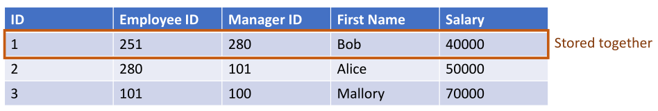

# Big Data Engineering

## General Hadoop

### Compare and contrast the Hadoop Distributed File System (HDFS) and a local Linux file system.

Both HDFS and local Linux systems support common file operations such as listing files, reading files, writing files, changing permissions on files, creating directories, removing files and removing directories. Both store data in blocks. Both have a POSIX-style command line interface.

Linux' namespace sits on the local system, whereas HDFS' lives on a namenode, which can set on  a second physical machine. The files on a Linux machine are stored on the local storage medium, while HDFS will spread (distribute) these files across servers to maintain redundancy and availability. Both use blocks, which are chunks of data spread across storage, tracked by the file system. The filesystem operations are also very similar, thanks to HDFS sticking with Linux familiar commands. Importantly, HDFS can scale out onto multiple pieces of hardware, and achieve fault tolerance, while Linux is stuck being local. 


HDFS typically has much larger block sizes than Linux. Hadoop is also able to replicate data for redundancy at the software layer. HDFS is a distributed Java application that runs in Java Virtual Machines (JVMs).

### Cloud Money Savings

On a side note, AWS and other modern cloud storage architectures have inexpensive cloud storage options such as S3 or Azure Blob Service. 

Big data environments don't have to use hdfs as a back end file system. They can use cloud storage instead. They're just POSIX-like interfaces with an hdfs back. So, clients can replace expensive hdfs clusters with Amazon S3 to save money.

That's a benefit of decoupling compute and storage. You can turn off your expensive compute resources, and still maintain the the storage to save money. You can then shut down your compute when you're not using it.

### Describe the difference between two different **scalability** options: scaling up (vertical scaling) and scaling out (horizontal scaling). Which is considered preferable for big data applications? Give one reason why this is.

When you scale up vertically, you're improving the hardware by increase processer speeds, total RAM, adding additional storage, and improving other components. As you increase performance, cost will significantly increase as you move closer to the latest cutting-edge technologies. 

When you scale out horizontally, you're increasing the total count of hardware. That is, you're plugging in an additional server. In doing so, you can purchase low price commodity computers, and achieve performance through duplication.

### List and briefly describe the roles and responsibilities of the **Name Node** in the HDFS architecture.  Additionally, explain an **active-passive** cluster configuration (this is a general high availability or HA cluster configuration and it is used in Hadoop to achieve HA and recover from Name Node failures). If you are having trouble it may help to contrast this with an active-active cluster configuration.

According to Hadoop The Definitive Guide (page 48)...

#### Name Node

The Name Node is the master node in HDFS' master-worker pattern. It manages the filesystem namespace, maintains the filesystem tree and all related metadata. The info is stored persistently on local disk in a namespace image and edit log. If the namenode were destroyed, all files in the data nodes would be lost - but you can take steps to avoid this (persistent backup to local disk, secondary namenode).  Active-passive cluster configuration (a High-Availability cluster configuration) is when if one node goes down, another one steps up to become active, allowing for faster failovers.

#### Name Node High Availability

Active-passive cluster configuration (a High-Availability cluster configuration)  is when if one node goes down, another one steps up to become active, allowing for faster failovers.

The name node keeps track of the file system image and file system namespace, regulates client access, takes requests from clients, instructs data nodes on where to write replicas, and ensures data nodes are up.

### Describe the role and responsibilities of **data nodes** within HDFS.

#### Data Node

The Data Node is the workhorse of the filesystem. They store and retrieve blocks, and occasionally report back to the namenode a list of blocks they're storing. Data nodes normally read from disk, but if a block is frequently accessed, it will be saved in memory (Hadoop The Definitive Guide, page 48).

Data nodes serve read/write requests, perform block-level operations per instruction from the name node, replicate blocks in a pipeline, and report health and block status to the name node.

### Give the general **sequence of steps** that happen between the HDFS Client, Name Node, and Data Nodes when writing to HDFS.

The sequential order of events when writing to HDFS begins with the client initiating a file write into a local buffer. From there, the request is passed to the Name Node, which selects the Data Nodes for replication. The write starts sending chunk by chunk to DataNode1, which immediately sends to DataNode2, and so on, until the request reaches the final Data Node. The client will close the file stream, which clears data to DataNode1, which acknowledges buffer, and NameNode is notified of write complete. It then commits the new file as complete.


In summary:

1. Client initiates file write to a local buffer

2. A NameNode request is made. NameNode selects data nodes for replication and provides instructions to the client. *The client goes to the name node.*

3. Data is sent chunk by chunk to the first DataNode. Behind the scenes, chunks are replicated across DataNodes in a pipeline fashion. *The name node responds to the client "hey here's the data node you should write to". The client writes to the data node and then behind the scenes that gets replicated to a pipeline.* 

4. The end of the file is reached. A final chunk of data is sent to the first data node and an acknowledgement is returned to the buffer. *Once the whole replication is complete right so once you've written to all three nodes. All file blocks are replicated three times.*

5. Client notifies the NameNode that the write has succeeded and the NameNode adds that file to the file system namespace for later access. *You can respond back to the name node saying that this file right operation is done, and only then is the new file committed to the file system namespace and available for for reading and writing.*

### Checkpoints, recovery, data replication

#### Checkpoints

Checkpoints periodically happen when the Name Node flushes the in-memory file system (used at runtime because it's more performant). Checkpoints happen when that's flushed to disk. That means if the Name Node goes down, you'll have to restore from that fs image from the most recent checkpoint.

### When interfacing with HDFS using the command line interface, what is the **format of each command**? How will this help you differentiate between commands interacting with HDFS via the command line interface (e.g., hdfs dfs -ls) and commands interacting with the local Linux file system (e.g., ls).

When inputting commands into HDFS, you format each line by starting with hdfs. It provides POSIX (portable operating system operations) commands.

This helps you differentiate between a standard linux commands and ones meant to run on hdfs. For example:

```bash
ls  # list present working directory files/folders on your linux file system
hdfs dfs -ls  # list present working directory files/folders on your hdfs
```

When you use HDFS DFS, you're interacting with Name Node and Data Nodes. Without, you interact with local file system.

### Which company first introduced **Map Reduce** as a programming model? Briefly describe the role of mappers and reducers.  Finally, what language is the Hadoop implementation (Hadoop MapReduce) written in?

Google introduced the Map Reduce programming model, using Java. The role of mappers is to do the same operation on all data records, in parallel. Afterwords, the reducer operation aggregates the record using an operation such as Sum, Average, Count, etc.

### In Hadoop MapReduce, where is data written at the end of a **map or reduce stage**? Describe why this design decision has contributed to the preference of **alternative tools** for batch computation.

Lecture 1, 2h20m

There are two paths to a data write in MapReduce. A large batch process path runs (perhaps weekly) and eventually appends to a large dataset, followed by a batch processes which computes that data and writes to a read-only database. Meanwhile, all new incoming data is sent to a speed path, which usually computes in-memory and then writes to a read/write database such as Cassandra. 

After both dataset paths complete, you union both datasets to find the finalized analytical dataset.

As an aside, this is where the term "eventual consistency" comes from. The batch data is "immutable" until it reruns. Until that finishes, it's inconsistent, but eventually will be.

This design decision has caused people to prefer alternative tools for batch computation because 

Spark is more performant and feature rich than MapReduce, because it doesn't write to the file system after every map and reduce stage. It's all in memory.

### Row vs Columnar storage

#### Row based storage

SQL RDB.

Entire rows are kept together and identified by an internal key (e.g. ID, not necessarily PK). Row-oriented stores are akin to .csv files, with each row being stored alongside that row ID.



#### Column based storage

Store all values for a particular column together. Row identifiers (IDs) exist within columns. 

Instead of storing all of Bob's data alongside Bob, we store all employee IDs in their own collection. These are physically closer together in storage.


The first element in the list belongs to Bob. It's not just a transposition, it's **storing all related data together**. All Salaries are stored together.

#### Disk Implications


On a hard disk, there's magnetic disk spinning, and an arm to read the data. The the head of the actuator arm, the the pinhead, gets really close to a certain portion of the disk and determines if it's magnetized or not. That gets you the binary value. Different sections of the disk are broken down into addressable spaces. 

Hard disks are really good at sequential access, because as the disk spins, the arm doesn't have to move far. This lets you read data very fast in a sequential fashion. On the other hand, if you have random access, you have to hop around different spots on the disk, and the arms moves a lot which adds to overhead and latency, aka Seek Time.

So when we think about how we choose to store data, we're looking to reduce seek time, in the amount of time it takes to read that data, knowing that sequential access is faster. 

If we have a transactional data store, and we know that we're going to be updating rows, reading rows, writing rows all together, then use a row oriented storage format, like a SQL table. Stored sequentially on disk.

If we're doing advanced analytics, however, like if we're doing aggregations on a column...let's say we want to take the average salary for all employees, or find the the managers with the most employees - for those kind of AGGs, typically columnar storage is better. If we need to retrieve all employee IDs very quickly, it makes sense to store those together on disk. if we need to retrieve all employee salaries together very quickly, it makes sense to store those sequentially on disk.

##### Summary

Sequential access is a lot faster than random access. Therefore, if we're doing row-oriented operations, use a row-oriented data source, such as selecting a single row/writing a single row.

If we're doing column-oriented operations (AGGs like max/sum/avg) on particular columns, then use a column-oriented data store.

Also, in columnar, there is **better compression**. All values in a row being the same datatype means better compression, less space on disk. It's also faster at selecting a subset of columns. If you're not doing:

```sql
select * from table1
```

But instead: 

```sql
select max(salary) from table1
```

We could very easily aggregate just by grabbing the salaries. It would be the same column, and be the same data type, it would compress better because there's more repetition in the data. Better for analytical systems in short.

## Other database types, strengths


These databases are geared to provide data consistency or data availability or partition tolerance.

Data consistency = it's replicated in the same across all nodes. Availability = Graph databases very roughly, emphasize more data. Partition tolerance = because they're more distributed, those network partitions become more important.

### Document database

**MongoDB, CouchDB,** etc.

Store data in document formats such as **.json .xml .yaml.**

Document databases are eventually consistent, but more geared around the availability and partition tolerance, and if the data isn't the same on every single node, maybe that's acceptable for a document database.

It differs from RDB in that it has **no schema** for those documents. In RDB, you have tables with columns and column types, maybe string or varchar.

They facilitate nested objects within documents. RDBs relate data via a FK. In a document database, you put the entire object hierarchy in the document.

Meaning that, you might have a Department table, and instead of relating the employee table in the department table, you just have a Department document with a list of employees inside that same document. Sort of a nested object approach.

### Object database

**Dopbox, Amazon S3.**

Document is stored in formats, such as .json .xml .yaml. Schemaless and unstructured Object database store data as objects

You don't have to store text data, you can store **binary data** for literally any object. An object in an object database, such as Amazon S3 or Dropbox.
It could be a file like a .pdf or an image, it could also be a hard disk drive, a disk image for a virtual machine. You might have a 16 Gb volume for an OS and rather than putting that directly on the OS, you might mount cloud storage as an option. You could do this to persist your operating system, just like you would on like a hard disk drive. So it could be anything from an image, to an .mp4 to an OS image.

### Graph database

A graph with nodes and edges.

You'll have nodes as objects (an employee), then you'll have a department node (finance), then you can relate the employee to department.

Graph databases provide additional flexibility in relating things. You don't need a FK constraint. You essentially just draw a line between one instance an employee to the associated department. You can then have key value pairs associated with both the employee and the department, as well as a relationship between them. Relationships are read as a verb, where an employee belongs to a department.

It's great for creating flexible relationships, as well as performing graph traversal. If you have one node and you need to find all linked to nodes, it's very easy to do a, very fast. You can also do level based queries. You can go a certain # of hops away. Six degrees of freedom, where you can find all nodes within six relationships of a single node. So there's different flexible ways of querying graph databases again.

### Key Value database

Amazon DynamoDB, Riak, Voldemort, Redis, MemcacheD, Cassandra, Hypertable, Hadoop HBase

Data items are denoted by key, it's addressed by a key, and the key has a set of attributes. All data relevant to that key is stored with the key. You might frequently duplicate data, to keep it more usable. You might have the set of data associated with multiple keys, so you do end up with more data duplication in a key value database. It's very easy to partition just because everything is associated with a particular key. So, as far as partition partitioning by key, horizontally scaling by key, keeping associated keys closer together...that's an easy thing to do.

### Compare and contrast Avro, Parquet and ORC file formats based on these characteristics

#### Avro


The defacto standard for row-oriented data storage in hadoop. Suitable for transactional systems. Storage for table. Constantly reading/writing to a table, use Avro. Pandas dfs.

Not a SQL database, but a way to store files on disk.


##### History

Avro started as part of Hadoop, but eventually joined Apache Software Foundation in 2009. It is a row-oriented storage format, best used to send/receive data between various Hadoop components. It has a schema definition formatted like a json.

##### Schema Evolution

Schema evolution is best supported in Avro. 

##### Compression

Avro has an optional compression codec (binary and json), with a sync marker for defining compression boundaries.

##### Row vs. Columnar

Row oriented storage reads/updates entire rows faster, but columnar reads/updates entire columns faster. Row-oriented is preferred for transactional, while columnar is best for analytical.

##### Processing vs. storage

Avro filetype boasts storage-friendly compression. In terms of processing, the filetype can perform CRUD row operations faster.

#### ORC


Optimized Real Columnar storage, to make it easier to perform aggregate operations.

Created with Hive in mind, and performant with Hive.


##### History

Optimized Row Columnar was created early 2013 by Hortonworks and Facebook. Originally created to speed and support data processing in Hadoop (Hive). 

##### Compression

Offers a lightweight read/write and a standard compression, which can be defined directly in a CREATE TABLE DDL statement.

##### Row vs. Columnar

This is a columnar storage.

##### Processing vs. storage

ORC processes faster than Parquet in Hive. 

#### Parquet


Parquet was created to be more to be portable across all hadoop components. As such, it was written in Apache Thrift (a development tool that helps you define code in a cross platform fashion), so that you can take some language agnostic definition of, say, objects and functions, the programs that you write the code that you write, and use those language agnostic definitions to generate code in many language.

Ez for pandas using pyarrow.


##### History

Parquet was created early 2013 by Cloudera and Twitter. While ORC was created for Hive, Parquet was created for all Hadoop components.

##### Compression

In Parquet, column chunks are broken into pages, which are then compressed.

##### Row vs. Columnar

Parquet uses columnar storage.

##### Processing vs. storage

While ORC usually outperforms Parquet in Hive and ACID transactions, you'll need to check benchmarks for Parquet vs ORC outside of Hive.

Cloudera and Hortonworks have merged, and both ORC and Parquet are top-level Apache Software Foundation projects.

#### Summary

##### Schema Evolution

Schema evolution is best supported in Avro. 

##### Compression

Columnar storage in Parquet and ORC lead to better compression ratios than Avro.

##### Row vs. Columnar

Parquet and ORC store data in columnar format within row groups making them more suitable for analytical processing. Avro stores data in row-oriented format making it more suitable for transactional processing.

##### Processing vs. storage

As Parquet and ORC result in better compression ratios they require less storage. Also better at reading entire columns as this results in lower seek time with columnar storage systems.

Avro results in more sequential read/write operations on rows, therefore there is less seek time when operating on rows. 

## Useful HDFS Commands

Using the Hadoop file system shell documentation, describe the functionality of each of the 15 commonly used commands below. Since many of these are POSIX utilities, some are similar or identical to Linux commands.
https://hadoop.apache.org/docs/r2.4.1/hadoop-project-dist/hadoop-common/FileSystemShell.html 

```bash
hdfs dfs -ls  # when run on a directory, lists all direct children
hdfs dfs -mkdir /user/hadoop/dir1 /user/hadoop/dir2  # create directory
hdfs dfs -cp /user/hadoop/file1 /user/hadoop/file2  # copy file from source to destination
hdfs dfs -mv /user/hadoop/file1 /user/hadoop/file2  # cut and paste. You can't mv files across systems
hdfs dfs -cat  # stdout prints content of the file
hdfs dfs -rm hdfs://nn.example.com/file  # deletes...but only non-empty dirs and files.
hdfs dfs -rmr  # recursive version of the above
hdfs dfs -tail pathname  # prints the end of the file
hdfs dfs -put localfile /user/hadoop/hadoopfile  # copy one or more src to the destination file system. Local or not, whichever
hdfs dfs -getmerge  # give it a source dir and destination file, and it will concat files in src into destination file
hdfs dfs -getfacl /file  # displayed the Access Control Lists of a file and dir. ???
hdfs dfs -chmod  # change file permissions. -R makes it recursive. You must be file owner, or else be super user
hdfs dfs -chown  # change the file owner, as super user
hdfs dfs -copyFromLocal  # like put, except can only copy from local
hdfs dfs -copyToLocal  # like get, except can only send to local
```

