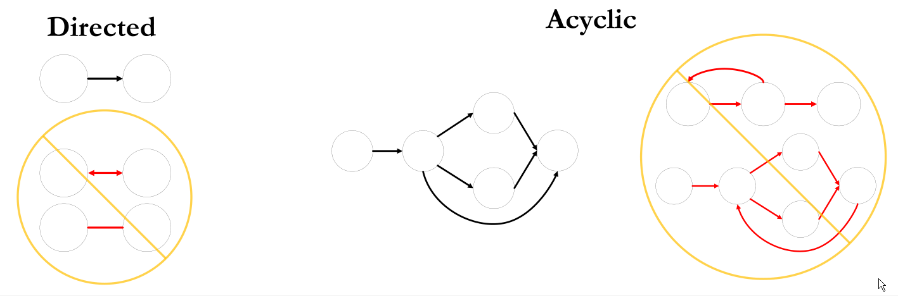
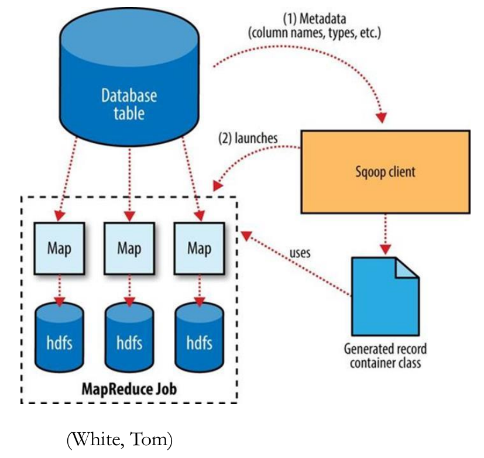

# Big Data Engineering

## Oozie and Scoop for Data Ingestion

One of the big problems you have in data engineering or data science is that we want all this data, but it's distributed across all these different external systems. Really, a heterogeneous environment. Some data might be stored in REST APIs that you have to involve to get the data, some might be stored in dbs that you can directly access. 

Over these next few lectures, we'll look at some of the tools and patterns for integration, starting with just a couple simpler hadoop ecosystem tools that are very popular for getting started in big data, to do to do very simple things. Like, integrate SQL databases with hadoop, as well as orchestrate workflows.

### Oozie

Like Cisco Tidal Enterprise Scheduler, or Apache Airflow (developed by Airbnb, code only, no GUI).

Oozie is a workflow orchestration engine. We'll look at actions that can be used in a workflow, and extensions, Oozie V2 which is coordinators, and Oozie V3, which bundles coordinators, and let you define start conditions for workflows, lets you schedule workflows. Bundles let you chain workflows together with potential dependencies between coordinators.

So you go from Workflows (Oozie v1), to coordinators, which allow scheduling workflows, with the workflow still being that sort of atomic Oozie component...and then bundles which can map dependencies between coordinators.


#### History, purpose, and place in the Big Data Reference Architecture

Originated in 2008 at Yahoo. Oozie is the Burmese word for elephant keeper. Wrangled, coordinates projects into one orchestrated workflow.

As a scheduler right, you have alternatives to it. You could execute Shell scripts on a schedule. Apache Ant is sort of an .xml way of defining jobs and workflows and dependencies. Or custom servers and Cron jobs on Linux. Task Scheduler in Windows.

Oozie makes it a lot more robust. You can use ACG (acyclic directed graphs).

It helps you consolidate logs for troubleshooting...tells you from an entire job level which step failed.

##### Key aspects

Manage execution and interdependency of multiple jobs. Track errors. Recover from failures. Monitor health of different systems running
multi-staged jobs. Should be extensible to support new types of jobs. Should run in a server to increase reliability(like multithreading). Should be a multitenant service to reduce cost of operations (many clients can submit jobs).

It doesn't do the execution, it only submits jobs and monitors for success/failure, and handles failure. It defines a dependency graph so when jobs finish, you can respond.


#### Why Oozie?

It can handle complexity, ease of integration with Spark, for instance, and more and more things are starting to depend on it.

#### Oozie vs Nifi

Oozie is used for workflow scheduling to manage Hadoop jobs. 

Nifi is used to automate the flow of data between software systems. 

Oozie runs a service in the cluster.

#### Edge nodes

Oozie doesn't run on a name node or data node, but rather an edge node. 

From an hdfs perspective, the name node and the data node would be for the hadoop distributed file system. They'll be running on virtual or physical machines on the back end. Typically you'd have the heavy lifting applications also running on the data nodes.

You typically have many data nodes within your cluster, and all heavy lifting applications running on those data nodes processing the data.

Integration and client applications usually run on one or two edge nodes for a cluster. A cluster might have one or two edge nodes. They're less rigidly defined, it's more of a concept that has come into fruition.

"OK, we're not doing anything with the data within the hadoop cluster when we're integrating. We're really interfacing with external systems and we're running client programs." So you might have one server within the cluster dedicated to installing all the clients (oozie client, sqoop client, hdfs client), as well as integration platforms, such as NiFi running on a separate space within the cluster, in this case, an edge node.

It's good to keep your framework sort of isolated from external systems. Edge nodes let you do this. 

A hadoop edge node within the cluster would run client applications, as well as potentially interface with external services (whether those are web services or messaging systems, whether it's JMS or other message queuing options).

#### Workflows


Workflows are called by convention **workflow.xml**.

They may need additional files like all scripts (.py), jar files, java libraries, etc. 

config-default.xml speficies default input params.



Workflows must be DAGs. Oozie will validate this. You'll get a compilation compilation error, when you submit the job, if your graph is bad.

Left hand side violated directed. Right hand side violated acyclic. Middle is valid. Directed and nothing goes backwards.

There's two components to DAG. 

##### Nodes

The circles. These are actions.

##### Edges

Links/vertices between nodes. They're sometimes directed. With a multistep workflow, when you complete one step, you're going to be directed to the next, via these vertices right. it's not bidirectional. It's just a single direction.

Bc acyclic, when you leave a node, there's no way to return to that node. 

##### Workflows, Coordinators, Bundles:

###### Workflows

Workflows are run on demand, to run some periodic analysis of an existing hdfs dataset. For instance, running a one-time job that runs a Map Reduce program, and sends a notification email if it succeeds, but otherwise halts the operation.

###### Coordinator

Coordinator is for running jobs periodically. For instance, running the above analytical job every Monday.


The workflow still is the sort of main component here, it does all the work in the job you've defined. The coordinator wraps that workflow in start conditions (typically a start time or maybe you check to see if more data is available). The coordinator can then execute. See the loop? The idea is, remember the workflow is a cyclic, so one workflow instance would start and finish...and then it would return to the beginning, and once the coordinator specifies that it should start again, you would run it again at another point in time. Then the coordinator finishes at a specified end-time.

###### Bundles

Bundles group coordinators into a single job. So those coordinators can be started, stopped, re-executed as one one bundle. It's a wrapper for coordinators.

Leveraging bundles and dependencies, you can execute a group of coordinators in a data pipeline, one after the other, as well.

Bundle is for running numerous coordinated jobs as one large batch. For instance, running sequential jobs, each of which starts with a Map Reduce, emails if successful, or otherwise halts the chain of operations on failure. Or an analytical job that runs after data ingestion completes, and only if it succeeded.

#### Control flow nodes - Start, End, Kill, Decision

Special nodes that literally just define where the graph **starts** and where it **ends**. Since it is a DAG, it has a start node and an end node.

There's the **kill** node which is special node that puts the process in a state of killed. Typically, this means that either an unexpected error occurred within the workflow, or an administrator said "hey this job is running too long", or "oops, i didnt mean to execute this/it's running too long i'm going to kill the job."

There's a **decision** node. It's a switch-case statement that decides which path to follow within a workflow application. Each case statement has a predicate defined in Java Expression Language (EL) and a “to” node. When a case predicate evaluates to True, the workflow exits the decision node and takes the path to the associated “to” node. A default node is defined in case no predicates evaluate to True.

**Forks** and **Joins**. Every fork node needs a corresponding join. This allows parallelism within the application within the workflow. So you might increase performance of a workflow if different parts of the job can run concurrently. You may use a fork and join node to achieve that that parallelism.

The join node is only executed once all of the incoming jobs have finished. 

#### Other workflow states

We've seen succeeded, killed, and suspended workflow states already. Here are a few more:

- Prep - the job has been submitted but has not yet been started.
- Running - The job has been started by Oozie
- Succeeded - the workflow has reached the end node
- Failed - the job encounters an unhandled error
- Killed - the workflow has reached a kill node
- Suspended - a retriable error has not been resolved

#### Action Nodes

This is the cool part. Action nodes submit tasks (jobs) to a remote server. 

If we're submitting big data platform jobs, such as a hadoop mapreduce job or a spark job, **those go to the hadoop cluster.**

But if we're doing things like executing an arbitrary jar file, or an ssh scripts **those may not necessarily run on the cluster**. So an action can be things like run a mapreduce job, for instance, or run a Java app, or ssh script. You don't really know what you're going to be doing in that custom ssh script. all you might be doing is checking the job status. There'd be no need to do that from every node in the cluster. You'd only need to do it in an **edge node**.

Computation necessary to complete the action is not done on Oozie but on a remote server. Oozie orchestrates the process flow and submits jobs; most of the heavy lifting is done outside of Oozie. Most Oozie actions execute tasks asynchronously. That is, Oozie submits the task and immediately closes the connection. To determine when the task is completed, Oozie either 1) waits for a callback from the service executing the task  (tricky, asynchronous) or 2) polls said service periodically until the task is complete.

First is the job notifying Oozie that it's done. #2 is more common, where it just keeps wasting clock cycles, pulling, to see if the job is done. #1 is harder, but better.

#### Action transitions

An **“ok”** element within the action defines which node is executed when the action succeeds.

An **“error”** element defines the node that is executed if the task fails. On error, an error-code and error-message is returned. For error handling purposes a decision node may define paths specific to the error code.

Each result points you to a different node. 

```xml
<action name=“map-reduce” retry-max=3>
	<ok to=“next-node”/>
	<error=“mr-error-handler”/>
</action>
```

There are certain errors which Oozie can retry, like connection errors. Wait 30 seconds, retry, for n tries, then suspend. If the error can't be suspended, it'll go straight to error node.

##### Other common actions:

HDFS, Map-Reduce, Pig, Sqoop, Spark, Email, Shell, Java.

#### Interacting with Oozie server

Interacting with Oozie server is as simple as using the Oozie CLI. There's also a web service API, just making it a little simpler to integrate with other web systems. The jobs API lets you do job stuff...checking the status of the job, submitting a job, killing a job, retrieving the job graph, the job logs. The admin API lets you query the Oozie server, get information like configurations, Oozie version, cluster info, etc.

### List the parameters that we have to mention in the job.properties file to submit an Oozie workflow.

Per the [documentation](https://oozie.apache.org/docs/4.3.1/WorkflowFunctionalSpec.html#a4_Parameterization_of_Workflows), in your config-default.xml, you must include the following parameters:

```bash
inputDir:  # e.g. <name>/data/raw</name>
outputDir:  # e.g. <name>/data/processed</name>
jobTracker:  # e.g. <job-tracker>hdfs://localhost:8032</job-tracker>
```

Otherwise, another common parameters passed into the Oozie workflow is the Name Node's URL.

### List down different elements in the action definition of an Oozie workflow for the below Oozie actions:

#### Map-Reduce:

- Prepare stage, which is used to clean up a directory of files
- Mapper executable
- Reducer executable

Mapper class, reducer class, pipes or streaming configuration.

#### Pig

- Pig scripts, which must exist within the workflow application on HDFS
- For YARN, a resource manager host:port.
- NameNode host:port.

Pig script, job tracker, name node.

#### [Sqoop](https://oozie.apache.org/docs/3.3.2/DG_SqoopActionExtension.html)

- To run a sqoop job, you must configure the job-tracker
- name-node
- command or arg elements 

Sqoop command line arguments like import/export, JDBC url of database.

#### [Spark](http://oozie.apache.org/docs/5.2.0/DG_SparkActionExtension.html)

- resource-manager
- name-node
- master elements
- other required elements, arguments and configuration

URL of the spark master node, spark job name, jar, main class.

### Identify which of the below workflows is invalid and explain the reason for that. (Hint read about fork-join nodes)


Oozie Control Flows are Directed Acrylic Graphs (DAG) and include these types of nodes.

- Start node

- Decision node is switch-case

- Fork and Join nodes

- According to [documentation](http://archive.cloudera.com/cdh4/cdh/4/oozie/WorkflowFunctionalSpec.html#a3.1.5_Fork_and_Join_Control_Nodes)

  > The `fork` and `join` nodes must be used in pairs. The `join` node assumes concurrent execution paths are children of the same `fork` node.

- Kill node is for error or killed by admin

- End node is the final node if workflow succeeded

Concerning the question as to which figure is correct, 

> It is possible to have nested <fork> and <join> nodes. The only constraint is that <fork> and <join> nodes always go in pairs and all execution paths starting from a given <fork> must end in the same <join> node.
>
> Apache Oozie The Workflow Scheduler for Hadoop, pg 78

In the image above, Figure A violates this constraint. Each fork must have a corresponding join.

## Sqoop

Made by Cloudera, became Apache in 2012. "SQL to Hadoop" = Sqoop.

Sqoop2 is depreciated, and Sqoop1 is supported.

We looked at Oozie as one platform, one job scheduling component, within the hadoop framework. It's the first specific platform component that we've looked at in depth, aside from hdfs. So it was a job orchestration engine and scheduler. 


Similarly, Sqoop does one thing well. It integrates between relational db and hadoop. If you need to sort of batch import data from a relational database to hadoop. Or if you need to go the other way and export data from hadoop to relational db. 


Integrates well with Hive (the SQL db built on top of hadoop).

Sqoop is just one action supported by Oozie. You might create an Oozie workflow to import data from a relational db to hadoop. That would be a sqoop action in an Oozie workflow. And then submit a Hive action to transform that data. Or maybe a Spark action to transform that data, now that it's in hadoop.

First step is data integration aka data ingestion, where we're essentially connecting to remote systems and collecting the data that we need, bringing it into hadoop. Oozie is good at orchestrating jobs and leveraging platforms like Sqoop and Java to do the integration.


Other ETL competitors include Qlik Replicate and Compose, and Informatica. Oracle GoldenGate. 

### Describe the key features of the Sqoop import process in detail (how it interacts with the database source and Hadoop, splitting, data replication, etc.)

According to Hadoop, the Definitive Guide, pg 409, Sqoop imports tables from a database via MapReduce, which extracts rows and records them to HDFS. Java's JDBC allows applications to access relational database tables. Oracle, MySQL, and other database vendors have written their own JDBC drivers that allow JDBC APIs to connect to their servers.

Sqoop will try to predict which database driver it should load, when supplied the URL in the connection string.

Sqoop begins by using the JDBC to examine the target table. It collects all columns and their datatypes. The SQL varchars get mapped to Java Strings, the SQL Integers map to Java Integer, etc. These Java data types will hold the field values coming from MapReduce. Sqoop generates code from these classes. e.g.

```java
public Integer get_id();
public String get_widget_name();
public java.math.BigDecimal get_price();
public java.sql.Date get_design_date();
public Integer get_version();
public String get_design_comment()
```

JDBC's ResultSet creates a cursor which retrieves the records. readFields() then populates the Object's fields with one row from ResultSet. I imagine this is similar to how a class can be modeled as a database table, and each attribute is a column. Each instantiation would be a record. So you're just reading in all instantiations, row by row.

write() then exports the data to a new table.

In order to parallelize and improve performance, the columns are split apart across multiple nodes. Using the table metadata, Sqoop will determine which column the data should be split on (usually the PK). Min(PK) and max(PK) are calculated, and the difference is used to determine how many rows each Mapper should process. If there are 10,000 rows and 10 nodes, each node would map 1,000 rows.

After the deserialization code and configuation is complete, Sqoop sends the job to the MapReduce cluster. Map tasks execute the queries and deserialize rows into the generated class, stored in SequenceFiles or into delimited text, before writing to HDFS.



### Scoop architecture

The scoop client (might be running on an edge node or potentially the master node). It can inspect the database to get metadata about column names, column types, table names. 

Then, it generates the mapreduce code (in diagram, the generated record container class).

Finally, it launches the mapping job. The mappers are what collect the data, so the data doesn't physically go through Sqoop. Sqoop submits a mapreduce job, mappers that collect the data from the SQL database, and write it to hdfs. As you pass in Sqoop jobs, there's a JDBC connection string, so there's a standard JEE Java database connectivity, or JDBC adapter implemented for different databases. Sqoop can work with Oracle, MySQL, MS SQL, Teradata.

### Import tables

You need to use a PK so that different chunks of rows can be sent to different mappers. If no PK, it's single threaded. 

### Merge

Merge performs an **upsert** = inserts or updates based on inspecting two different data sets, and if there's a record from the source data source that's missing in the target, it'll perform an insert. However it finds a match based on some key, it will instead update that record.

Essentially, it checks if a match exists in the target based on some identified key. If a match is not found, it's an insert. If match is found, compare the timestamps from the target to the source and take the latest. If the modified date on the target is later than source, don't do anything. If the modified date is later on the source, then propagate that update to the target.

### Saving jobs

`Sqoop job` command allows you to create, list, and run named jobs, which are saved locally or to a shared sqoop metastore.

```bash
sqoop job --create  # creates a new named job
sqoop job --exec  # executes a saved job
sqoop job --list  # lists all saved jobs
```

Jobs are saved either locally in local user sqoop dir, or create a sqoop metastore, accessible by other users.

### Supported file formats

| format                                          | flag              |
| ----------------------------------------------- | ----------------- |
| Text (csv, etc)                                 | --as-textfile     |
| Avro (row oriented, de facto)                   | --as-avrodatafile |
| Sequence File (native hadoop files, compressed) | --as-sequencefile |
| Parquet (columnar)                              | --as-parquetfile  |

### “Sqoop export is not an atomic operation”. Evaluate this statement and describe how Sqoop solves this problem.

Atomic is used in databases as part of the ACID principal. Several operations can be grouped into a single transaction. A transaction has a start time and an end time. If one of the operations fails, the whole transaction fails and rolls back, as if no change was ever made. In this sense, either all the operations in a transaction occur, or none of them do. This is atomic - indivisible, irreducible. 

According to the [doc](https://sqoop.apache.org/docs/1.4.2/SqoopUserGuide.html), Sqoop exports are performed by multiple writers in parallel, each of which has it's own db connection. As such, each write transaction is independent. Sqoop runs up to 100 records per statement. Every 100 statements, the transaction writes. That means 10,000 rows per commit. Doing it this way means transaction buffers don't grow out of bound and cause out-of-memory problems. 

An export can produce partial results before completing, violating atomicity.

## Oozie and Scoop Commands

### List down the Oozie command line parameters to

#### [Run an oozie job.](http://oozie.apache.org/docs/3.1.3-incubating/DG_CommandLineTool.html#Rerunning_a_Workflow_Job)

```bash
# run job
$ oozie job --oozie http://localhost:11000/oozie -config job.properties -run -verbose

# params
                -oozie <arg>          Oozie URL
                -config <arg>         job configuration file '.xml' or '.properties'
                -verbose              verbose mode
```

Parameters are oozie job, oozie url (-oozie), config file (-config, usually job.properties), and -run.

#### Monitor the progress of the job being submitted.

```bash
# check job status
$ oozie job --oozie http://localhost:11000/oozie -info 55-201909141120505-oozie-job

# params
                -oozie <arg>          Oozie URL
                -config <arg>         job configuration file '.xml' or '.properties'
                -info <arg>           info of a job
```

Oozie job -info, id of the job, oozie url.

#### Finding errors in the oozie job xml files

```xml
<!--you can define your error handlers-->
<action name=“map-reduce” retry-max=3>
....
<ok to=“next-node”/>
<error=“mr-error-handler”/>
</action>

<!--as well as search for their appearance in the kill node-->
<kill name="error">
	<message>There was an error connecting to MapReduce</message>
</kill>
```

Pozie validate, workflow.xml, oozie url.

#### See the list of stored jobs in the Sqoop metastore

```bash
$ sqoop job --list
```

Sqoop job -list (not an Oozie command).

### You have a database with the sales data of 20 different countries in different tables and you want to import all the tables except China, Australia and England. Please write the command to import all of them using Sqoop.

According to the [docs](https://sqoop.apache.org/docs/1.4.0-incubating/SqoopUserGuide.html#id1766722), you can import all tables, and then [exclude](https://stackoverflow.com/questions/36485242/sqoop-import-multiple-tables-but-not-all) certain ones.

```bash
# no whitespaces in exclusion list
$ sqoop import-all-tables --exclude-tables "China,Australia,England"  --connect jdbc:mysql://localhost:3306  # possible incorrect
$ sqoop import-all-tables --connect ${jdbc_url} --exclude-tables China,Australia,England  # correct
```

### Describe in detail the direct mode of data transfer in Sqoop

The direct mode of data transfers leverages features unique to database providers to improve performance such as bulk copy in SQL Server or mysqldump for MySQL.

If --direct is provided as a parameter during sqoop import, "Sqoop will attempt to skip the JDBC adapter and use a native database connector".

### You have a table called Transactions with transaction_id as primary key. You are only appending new transactions, **and you need to periodically sync the table’s state to Hadoop for further processing**. How would you achieve that using Sqoop?

Updating or inserts, aka *upserts*, can be done with a Merge. You would check if a match exists in the target table, using the pk. If no match, insert. If match, then compare the modified dates. If source date is later, then update the target to match source. Otherwise, don't update. In CLI, that is:

```bash
$ sqoop merge --new-data latest --onto Transactions --target-dir merged \
--jar-file datatypes.jar --class-name RowDef --merge-key transaction_id  # possibly incorrect
```

Correct: Use scoop --incremental flag with transaction_id as the --check-column.

### Sqoop’s export feature inserts each row in a separate insert statement. Is there a way to batch multiple insert statements together? List down different ways to achieve this in Sqoop.

There are three ways to export data.

```  
1. As a list of import statements
2. As a list of update statements
3. As a stored procedure call for each record
This is possibly correct
```
Correct:

Use the --batch argument to batch multiple insert statements together.

If your goal is to have the Sqoop job be atomic, use --staging-table to first write to a staging table. Then Sqoop will automatically rename the table or remove it on the database side if something goes wrong.

### When should you use –target-dir and when should you use –warehouse-dir while importing data using sqoop?

According to [documentation](https://sqoop.apache.org/docs/1.4.4/SqoopUserGuide.html), by default, Sqoop imports a table named foo into a directory named foo, in your HFDS home directory. e.g.

```bash
$ sqoop import --connnect <connect-str> --table foo
# import into /user/garth/foo/
```

You can adjust that parent directory by using --warehouse-dir, where the argument is the parent directory. e.g.

```bash
$ sqoop import --connnect <connect-str> --table foo --warehouse-dir /shared
# imports into /shared/foo/
```

Alternatively, set an explicit directory using:

```bash
$ sqoop import --connnect <connect-str> --table foo --target-dir /dest
# imports into /dest
```

That is, when using --target-dir, Sqoop puts data files directly in the directory specified. When using --warehouse-dir, Sqoop creates a directory inside the directory specified. Then, it puts data files in that directory. Use --warehouse-dir when you're putting data for multiple tables within the same parent directory. 