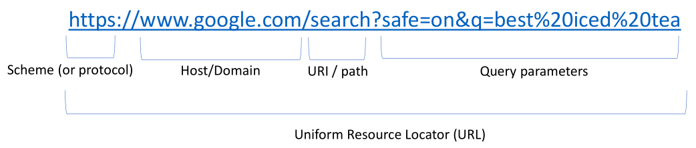

# Big Data Engineering

## Data Integration

### Review the integration platform NiFi and list down a few prominent and differentiating features of the platform

Integration is about how you read, delete and move data around on the server, or kick off a process. When you order something on Amazon, you're not only providing order info, but also invoking a backend process that might approve the order, assign a shipping data and a tracking number. Many services just provide CRUD operations, but there are also web services that let you perhaps invoke a process on a remote server.

Businesses usually have one system which creates data, and others which consume that data. This comes with challenges which are overcome by solutions conforming to various "Enterprise Integration Patterns".

#### NiFi

[NiFi](https://nifi.apache.org/index.html) is a data integration platform which automates the "dataflow" (information) between systems. Other integration platforms include Kafka and Mulesoft. NiFi has a GUI which lets you drag and drop processors and connect them with a relationship (directed acrylic graph). You might create an XML get processor, set certain configurations, and then connect it to another.
	

	
You can schedule processors using timers, events or CRON. Interestingly, you not only can say how often you want it to run (every X seconds), but also how long you want it to run for [0, 2 seconds] each time it runs. If there's an error, you can set Penalty or Yield durations, as well as determine how much information gets added to logs.
	

	
To run a connected set of processors, you simply click drag select, and click run. Each processor then produces bulletins, and summary stats (e.g. data in or out, 5/55 kb) you can review.


NiFi was written with a focus on various messaging systems.

### Explain why loosely coupled architecture is better than tightly coupled architecture.

*Loosely coupled architecture is preferred because pieces can be removed or added onto without much difficult. Each piece is independent which helps an architecture remain less prone to full system failures, increasing how a business can respond to consumers.* 

The foundational goals of integration is increase cohesion with an eye to promote **reusability** and reduced dependency between those components, so that we can **change one module** of a system without having to change make modifications to the other modules.

First, cohesion could be thought of as having multiple modules of the same system. Looking at the diagram, each color would represent a component. E.g., on a ecommerce site, green might be ordering functionality, yellow might be shipping system, blue might be the payment process. Cohesion is how you separate functionality into different modules. You group components logically together. You could do this with namespace Java packages, or even completely different software applications independent of each other.

Coupling refers to the arrows in between the components. Within modules, it is normal to have many point-to-point components interacting within a module. Intramodule communications is high, while intermodule communications is low. Within one module, you can edit the code, update processes, etc. But when you interact with another external system you don't have control over, loose coupling will really help.

On the right, is a bad system. Many dependencies between modules, not much cohesion, as all the logically tied components are connected with other components.


The degree of cohesion can be described as follows (from worst to best):

#### Cohesion

"How do we take all these different system components that we have, all these different software units we have to build, and organize them effectively." It focuses on the colors, in the illustration above.

##### Coincidental

Just sort of haphazardly lumped modules without any thought to the organization.`

##### Logical association

Modules perform sort of a series of similar tasks. In programming languages, you might see a copy module for copying files, or a transformation module for transforming files. 

##### Temporal

Modules are executed with respect to when they execute in time.

##### Procedural

We have some sequence of steps defined, and there's a fixed ordering. We've grouped modules based on steps in a process that get executed together. Like an Oozie workflow. A graph of steps being taken. All those steps could be put in the same module.

Now remember, our goal is to reduce coupling. We're starting to see less interdependence between system components, so it's easier to modify one system component without having to change all the others. Just because less dependence. The goal is reusability.

Has control flow.

##### Communicational

Similar to procedural, except there's not just a control flow (A > B > C), but there's also a data component as well. They all use the same set of data, like procedural, but as a whole, the process has the same input then the same output.

Has control flow. Single input, single output.

##### Sequential

(A > B > C) sequence input and output data being passed along. A sequentially cohesive module is one whose elements are involved in activities such that output data from one activity serves as input data to the next. Here, the output from one task becomes input for the next task. It's a sequence + data transfer.

Has control flow. Steps within the process have input and output, passed along as a chain.

##### Functional

**Ultimate Goal!!!**  Modules associated with the same function, such as ordering, shipping...real world functions. This is especially good when building services.

*Organizing components by function.*

Order management as a whole would be one problem. All order related modules go in it.

Microservices try to break this down higher levels of granularity between functions. So, we have our whole order management module, and if we wanted to break that down into micro services, we might have a specific module only for order intake, and another specific module only for searching products. Each one is chopped and separated.

#### Coupling

Coupling focuses on interdependence. It's more focused on the relationship lines in the illustration above.

When trying to connect one system to another.


Tight coupling is a brittle solution in that if any component in the system changes, it's likely to break the whole integration. Illustrated is a frontend web app communicating with a backend financial system. Data is being passed in some arbitrary fashion, not json or xml. Data is being sent back in some proprietary method. There are assumptions about data format, the time, technology, and perhaps even location (hard coded IP addresses). To reduce coupling, address these dependencies.


Use a common (self describing) data format like XML (human and machine readable), and use a common format for the message and a messaging channel that is external to the financial system. This would let our web APP not have to communicate directly with the back end.

Timing wise, if the financial system is down, we don't care, we just publish it to a queue. So if you place an order from the web app, the order is published, and when the financial system comes back up, it can consume that order. 

With the channel, we don't have to know we don't have to know the IP address of the financial system, we don't have to know the hostname. 

In a real organization, this wouldn't be 2 things talking, but many.

The degree of coupling can be described as follows (from worst to best):

##### Content Coupling

Two different applications accessing each other's internal data or information directly. Any change to one of the components necessitates a change to every other components that's connecting. Like a web app and a backend financial system accessing raw data directly in the format of the financial system.

If you change the financial system to incorporate a different data format, all of a sudden, you must update the web app.

##### Common Coupling

Two units refer to same global variable/shared database. Any changes to the back end database or global variables will require changes to all the other components. Best to abstract ourselves further away from using a shared database...and use control coupling.

##### Control Coupling

One software unit invokes an interface, another software unit. Think applications. Invoke an financial system API, but you need to pass some some control information to it. "Hey we're using this version of your financial system, and here's what we want you to do with the data." So, we do a deposit, then you return a confirmation. 

But we don't want to control the back end processing of of that data right, so the next best level would be stamp coupling.

##### Stamp Coupling

A software unit passes a group of data (like an object) to another software unit. We have an order object. The whole object needs to be passed back to the ordering system from the front end right, but now you need to create a shipment. 

But the shipment doesn't need that entire order, so you pass more data that's needed. So, data coupling.

##### Data Coupling

Only the necessary data is passed between software units. This reduces the interdependence, as well as the the data that each has to deal with. 

Login to Amazon, order something. The entire order goes to the backend. But then when we're creating the shipment, you only need to pass the shipping address and the product items and the person name. You don't need other details like price or payment method. Just enough data to create and track the shipment.

This tool helps us understand this.

https://www.enterpriseintegrationpatterns.com/patterns/messaging/index.html

It creates a common vocab to discuss integration patterns, create by Hohpe and Woolf.

### **For each integration style below, give one real-world example where it would make sense to use:**

This is how you think about what's being transferred. We can think about what's being transferred in terms of files being transferred, or maybe a shared database being accessed, or messages being transferred. All the messaging patterns discussed below would assume sort of a messaging system. Third Way of generally sharing data, if we don't do it via file or a database or a message you can do it via remote procedure invocation. That would be one programming language, one process on one machine invoking a procedure on another machine. Here, remote procedure means one programming language talking to another programming language, over some sort of object oriented protocol, some way of invoking a function on a remote machine.

#### File Transfer

Send a file from application A to application B. You're uploading files to Cloud9 or copying data from some file share on your network to your local machine.


It's good because it's platform and language agnostic. Anything can process a csv file.

It's bad because how do you update the data? Two people or systems can't write to the same file at the same time, without running into contention...locking and ensuring the integrity of the file.

It lacks synchronization. As soon as you export the data, we can assume it's stale in application A. And it's also only really suitable for sort of bulk data transfer.

e.g. If you were to transfer a single batch of csv files, where your talking across different OS, and need to process it in different languages, this is alright. 

*If you have a job that runs at a set time like nightly or weekly. The retail sales systems used to update stock availability nightly when I worked in the mall, but now they’ve switched to more real time. Our test environments are run on a file transfer with environments being built fresh on a monthly release schedule.* 

#### Shared Database

Same sort of bottleneck concerns. One db that has to service all these applications.

There are bottlenecks and deadlocks...we both try to access the same table. Two processes trying to access the same table at the same time, it's hard to ensure database integrity there without some performance cost, without locking.


Creating a unified schema is tough. 15 systems using the same table structure? Good luck. Often purchased software doesn't let you define schema.

e.g. If one or two small custom application needs to read a bit of data, no problem. You can control the schema, and locking/access won't be too obstructive.

*Customer Service databases are a good example of a shared database.* 

#### Remote Procedure Invocation

You have an application running on a local machine, or client server, or whatever. It's it's one application running on one server that needs to communicate with a different application running on a completely different server.


There's from an object-oriented programming perspective remote procedure invocation standards around how that's done. If you want to invoke a function from your job application on a remote Java application, that remote Java application can expose its skeleton of its service, it can define the function definition...what's the name of the function, what parameters are expected to be passed into the function...what's the response type. You can invoke that for your application without worrying about what the function is actually doing. All you care about is what's the input and what's the output. And what's the name of the function, what class, what library, etc. You can define those in RPIs, or Java RPCs.


e.g. According to [apisyouwonthate](https://apisyouwonthate.com/blog/understanding-rpc-rest-and-graphql), RPC is the earliest and simplest form of API interaction. You would use it when you want to run code on another server, for instance, to request all zip codes in a 5 state area. There's a method and some arguments. Nothing else.

```etc
POST /sayHello HTTP/1.1
HOST: api.example.com
Content-Type: application/json

{"name": "Racey McRacerson"}
```

In JS, this would look like:

```javascript
/* Signature */
function sayHello(name) {
  // ...
}

/* Usage */
sayHello("Racey McRacerson");
```

*https://www.informit.com/articles/article.aspx?p=169483&seqNum=4 lists Java, CORBA, COM use remote procedure invocation.* 

#### Messaging

This is about messages being sent (often asynchronously) between applications. They use some sort of message bus or message broker in between. This isn't a useful for importing between systems or batch exports, but it is good for sending small data on an event driven basis.


e.g. a user logging into a website, creating a web order and sending it to the back end systems.

*HOGAN PAS is a messaging system for the different parts of HOGAN. You can pass/process messages around the mainframe and in/out of the mainframe.* 

### Describe patterns from each of the below categories.

Without an integration pattern, you'd just have a direct connection between A and B.

There are 65 integration patterns.


But now that we formalized the different areas, we can create patterns and integration. We'll look at the whole flow from end to end. Application A needs to send some information to application B. So what technique to use? 

#### Endpoint

Could be a web service at an http listener sort of a web application residing on on that server, or like an endpoint for file transfer for ftp. More often than not these days, the endpoint is a web service (http).Many different endpoint patterns that will make this endpoint reusable. 

An endpoint is a piece of code internal to an application responsible for sending and receiving data. An API, if you will.

Example 1: Messaging Gateway - you write a class that contains methods for sending and receiving messages, separating it from the rest of the application code. That means the gateway only knows about the message system, and everything being it is hidden.

Example 2: Polling Consumer - used when you want your application to make a call to receive a message. The receiver polls for a message, processes it, then asks for another message. APIs usually block the receive method until a message is delivered.

#### Message Construction (data.xml)

Easiest to understand since we know what data looks like. This is data being sent. It can be a command message that might invoke a command on another server. A document message, to send data (like an order). Or an event message, where we're more interested in the event than the data. Or a request reply message, which has a format for both the the request and the response.

Like everything else here, message construction has its own patterns.

Example 1: Format Indicator - you should design a data format to include an indicator of what format the message is in. That lets the format allow for whatever changes it has in the future (pdf 1.0, pdf 2.0).

Example 2: Request Reply - if the application can send a message on one channel, and with a request-reply, the reply can pong back on another message.

#### Channel (kafka, jms)

Message format and other different types of channels, which we use to send data through.

For instance, you have the message broker pattern, which is similar to Kafka. The question is, how can we decouple the destination of a message from the sender and receiver? You do that through a message broker, which facilitates publishing two different message queues or topics, and it allows other applications to then subscribe. The idea is we published data to one spot, box in the middle, then multiple external applications can then connect and consume the data. It's the responsibility of the subscriber to know message channels, they want to connect to you which message broker to connecting. So you may publish an order to a message broker, that gets consumed downstream by perhaps shipping, orders, customer service.


Example 1: Point-to-point - Use this if you need to ensure that only one recipient receives the document. If the channel has many receivers, only one can successfully consume the message. If many receivers try to consume a single message, the channel ensures only one will succeed.

Example 2:  Guaranteed Delivery - even if the messaging system crashes, you can use this to ensure the message delivers. A built-in datastore persists the message. Each computer the messaging system is installed on will have its own datastore so messages are contained locally. When the sender sends, it won't complete until the message is stored locally. The message won't be deleted from that datastore until it's forwarded and stored on the recipient datastore. This means the message is always stored on at least one disk. 

#### Router

What messages you do care about, where to send them - Filter messages. Decide which to include/exclude. Can also determine what downstream apps will consume the message. You can have a recipient list of recipients that need to receive the message. Could have a routing slip telling it where to go. It could aggregate 10 orders together into 1, for performance enhancement.

It's the responsibility of the endpoint to define how data is sent and received from a specific application. It's an internal application component exposed often via an API. You then look at the data being transferred back and forth. You then look at the Channel and in which the is physically passed.

##### Example: Content-Based Router 

You can one of these to send messages to the correct recipient, based on the message content. The router opens the message, looks inside, sees where it should send the information.

##### Example: Message Broker

You can decouple the destination of a message from the sender, but still have control over message flows. The broker receives messages from sender A, B and C, and determines which channel each message should route to. AKA hub-and-spoke.

#### Transformation 

(translate message from .xml into .json) - Application A has a particular definition of an order. Application B has a different definition of an order. Whether that's two different xml schemas or two different json schemas, or two different relational database tables. The translator translates the data from application A and formats it such that it's consumable by application B.

Most importantly, you want a canonical data model. An organization will potentially have several systems that all have different definitions of purchase order. But within my organization, I only want to have to support only one. So, for every application that's passing around purchase orders, we first translate it to our canonical definition, so we have only one single master definition. So, we're going to translate that into the canonical def, then translate again for downstream applications.

Imagine translating between French English and Chinese. Difficult. Now add Spanish. Way harder. But if you translate everything into Latin, and then into another language, much easier!

Example 1: Envelope Wrapper - these can be used to wrap application data inside an envelope in order to meet infrastructure requirements. For instance, messages usually contain a header and a body. The header may contain format information, router information, or other content used by infrastructure. An endpoint may not know how to process any of this. So you wrap it up nicely for the endpoint to understand.

Example 2: Content Enricher - You may send data including just the ZIP code and not state, but the recipient application may require state. When the message creator doesn't include all required info, you can use a content enricher which pulls in an external data source to fill in missing information.

#### System Management

You can plug in a monitoring component to try to validate what's happening with the messages, kind of a log. You can sort of re flow messages at this point, you can purge different channels, using the monitor...add a wire tap to log the data. You can inject some peripheral monitoring component to monitor components between router and translator. Then, you'll get to a new endpoint.

### Explain the primary difference between command, document, and event messages in terms of message content.

##### **Command** Message 

The Command Message pattern reliably invokes a procedure in another app.


It's just a message that happens to contain a command. 

*A command message has a command in it.*

##### **Document** Message 

Document Message reliably transfers a data structure between apps.


Whereas a command message tells the receiver to do something, the document message just passes data. The receiver decides what to do with it.

*A document message has data in it with no instructions on what to do with the data.*

##### Event Message

The Event Message is for reliable, asynchronous event notifications between apps.


If something needs to be announced, you create an event object, put it in a message and send it on a channel. The receiver can then process it.

*An event message is a message that contains a notification that an event has occurred.*

### Which channel pattern would be most suitable for a streaming application that sends data to multiple downstream applications? Why?

The most suitable channel pattern for streaming data to multiple downstream applications is the Publish-Subscribe Channel. 


The publisher delivers a copy of an event to each receiver. There's one input channel which splits into many output channels, one for each receiver. When an event is published to the channel, a copy delivers to each output channel, which has only one subscriber. As such, each subscriber gets the message once, consumes it, and the copy is deleted from the channel.

*A publish subscribe channel pattern allows for multiple receivers and then sends a copy to each subscriber that would be interested in the message. It is most suitable for multiple downstream applications because each receiver gets its own copy so even if a receiver reads destructively or alters the data, the other receivers are not affected.* 

### Name the type of cohesion that matches the below descriptions.

#### Temporal cohesion

In an event processing platform, several different components are invoked around the same time when an event comes in (write a log entry, store the event, check for subscribers).

Modules are executed with respect to when they execute in time.

#### Sequential

A web application has separate components that launch a form for user entry, validate the form, invoke a REST API to store form data, then show a confirmation to the user.  Since these are executed one after another they are put into the same module.

However, you could also say communicational cohesion - there is one input which send data from element one to the next, and at the very end, there is one single output.

#### Logical

For an e-commerce application, all components related to placing an order are in one module while all components related to searching products are in another module.

### HTTP

Lecture 5, 47:00

HTTP can be used as a transfer protocol to facilitate messaging, but it's not  a messaging pattern.

Now look at how these services are physically implemented. We'll talk about web services, APIs, and how we leverage it to implement web services.

Think of all the database operations like Create Read Update Delete (CRUD). We also need to do the same operations on data that we access over the web via APIs. You'll find if there are applications communicating back and forth, they typically don't share a backend db. You don't want to be coupled tightly to the backend db of another application, so they'll just expose their functionality by using web services. These are the endpoints used to invoke some functionality within an application.

Hypertext Transfer Protocol is a request and response protocol between applications running on a client and a server.


When you're browsing the web, your browser is taking care of http requests going back and forth between your machine and the remote web server. 

When we talk about what is a **web server**, it's essentially the application or the server running your web applications, exposing those http ports (80 and 443), and using those to communicate back and forth with typically a lot of clients.

#### HTTP Request and Response Structure

##### Request 


**Accept** is an indication from the client to the server saying "this is the data format that I accept" or maybe "multiple data formats, that I accept" 

**Authorization** header is very common. The client sends it to authenticate, either via sort of username and password, or standards like OAuth to the server.

You see query **Parameters** being passed. We can actually do that in Google.

```http
https://www.google.com/?q=why%20am%20i%20so%20cool
```

The **Client** could be a web browser, or another application.

If you go to www.nytimes.com, you get html back. Http is a data format for describing web pages in a markup language, which can be rendered by browsers.

**Headers**: Accept: text/html - This tells the server that the browser wants to get an HTML-formatted page back. It’s the most readable format for humans, so it makes sense that your browser would request it. You don't see these unless you dive into developer tools.
**Method**: GET - This is the read method in HTTP and is generally the method used by browsers when reading web pages. When you're browsing, you're only really using GETs.
**URL**: uniform resource location. The host name, and everything after that, (URI, uniform resource identifier). This is the only piece you indicate for the browser.
**Body**: none - A GET request doesn’t need a body, because you’re not changing anything on the server - you’re reading what’s there. This is where your json or xml document would go, where the data goes. If you're posting an order, you'd put the data in here. The POST goes to the backend server.

##### Response 


The web server will process the request and give us back a response.

The server is likely to send back several headers giving information about the system and the response. All requests have a method, and all responses have a status code. 

[http status codes](https://developer.mozilla.org/en-US/docs/Web/HTTP/Status)

2XX means that the request was successful

3XX is a redirect to another location "hey, you went to http, we'll send you to https"

4XX is an error in the request from the client (didn't authenticate, missing some expected query params, etc.)

5XX means the server had a problem.

200 - Everything worked correctly:
▪ Headers:
	▪ Content-Type: text/html - as requested by the client
	▪ Date: <date of response>
	▪ Content-Length: <size of response>
▪ Body - The content of the page. This is what you see if you “view source” within the browser - the HTML page that tells the browser how to render the page and what content to display.

#### Addressability

lecture 5, 1:03:00

We need to address items on the server. If google.com is the server, you need to specify different Google services. Go to www.google.com/images, that takes us to the image search. You can go to books.google.com, the subdomain. 

If you go to google.com:80, you get redirected to https on port 443. It actually physically operates on a different port. Or go directly to google.com:443

#### HTTP Methods


Common http methods include post, get, put, delete. They're sort of directly analogous to CRUD database operations.


##### Which http method doesn't allow request bodies?

If you're doing a POST or PUT, the request will need the body, because you're inserting or creating an order. But GET is to retrieve the order. DELETE can have a request body, but it's typically not needed. GET doesn't need the entire order to read the order. You might use an order id. Same with delete. You can typically pass that in the URI.

#####  Which http method is suitable for reading an order? 

GET.

##### Creating an order

POST.

##### Updating

PUT

##### Deleting an order

DELETE

When talking about web specifications, you can find the RFC easily.

https://tools.ietf.org/html/rfc7321


Check the latest version of the spec. 7321.



Implicitly, there's a port there. 443 for https. Search parameters are name-value pairs. Spaces are URL encoded into %20.

##### Http request body

Data that get's sent along typically with POST or PUT or PATCH request. It's json or html or xml or text, some binary, you can do a lot. URL encoded form data is another one, if you're submitting a form.

### REST

In the late 90s, early 2000s a few standards emerged. The first was REST. 

REST was introduced in 2000 by **Roy Fielding in his doctoral dissertation**. As defined by Fielding, REST:

> "provides a set of architectural constraints that, when applied as a whole, emphasizes scalability of component interactions, generality of interfaces, independent deployment of components, and intermediary components to reduce interaction latency, enforce security, and encapsulate legacy systems."

Roy Fielding is a principal author of the HTTP 1.1 specification and a **cofounder of the Apache Software Foundation**.

The paper was hard to understand...but you basically want to expose general interfaces that can be invoked by any other applications, that are scalable (a lot of other systems can interact with them), that are independent of the deployment of different components. Say the backend infrastructure updates some code, you can reduce dependence between systems.

That is, we can change the backend without changing the web service. So you can swap databases, change table structure, as long as a web service stays the same, then the the interface doesn't need to be updated. The backend can be independently updated.

#### Rest Architecture Constraints (Advantages)

There are various constraints, or advantages to REST.


##### Statelessness

The server needs to be stateless in that any client state needs to be passed by the client. It's the responsibility of the client to maintain state info. That way the web server can take the request and respond to it without needing to know what's going on on the client. The client just passes any info. These are cookies. That's state info maintained on the client by the web app and browsers.

Client tracks with cookies, sends to server when needed. There's no stickiness, affinity on the server. The server doesn't maintain the state of the calling application. Fire and forget.

###### Advantages of Statelessness

You don't want the server tracking information about the session.

It scales better to more callers if the server has less complexity to deal with. Less state management. 

HTTP is stateless, so it helps for RESTful server implementation. 

##### Cacheable

Http actually provides some cache control mechanisms.


Make a request to a URI, get a document or an object back. If the object doesn't change, just cache it in an intermediate store. "The next time we make this request from the client or from another client, we already have the state of the entity cached, so just return the response from the cache, as opposed going all the way to the back end database over and over again, for the same row." 

It's better if clients access the same row to cache this in the intermediate Cache Implementation layer (see image), then be able to either invalidate the cache or expire the cache after a certain amount. 

Your browser does some caching in local storage or in potentially cookies right. So does the server, usually in like an in-memory cache, or it could be a proxy server, or your web server itself. There's different layers networking components that can do caching.

Caching reduces load on the backend, reduces bandwidth needed, reduces latency because you get data directly from in-memory cache as opposed to a round trip to a database. Also cache a response in case there's some failure in the network.

##### Uniform

Http provides a uniform interface using http methods and resource names, URI.


##### Layered

You have a web interface abstracting all of the back end complexity here.


See the image above. There's a database or data sources hidden from the client. All this stuff is hidden from the client. The client only knows about the web service interface.

##### Code on demand

Java applet, Flash (deprecated finally), Adobe Action Script, Silverlight. It's a dubious proposition to just download code from a remote web server and start executing it on the client. Not super secure.  

Javascript, client side programming language, still very much alive and thriving. It's all JS today.

This is dated. A rudimentary example would be requesting a pdf documents, and the REST service might also respond with some code needed to interpret the pdf. Legacy java applets follow the same.

#### Client-Server

Client makes the request, server responds. This separates the concerns between the client machine (when web browsing it's your laptop building a web application). Whoever requests it. It separates concerns between the interface, and the requester who needs to consume the data authenticate, pass along state. The server does backend processing, deciding what to respond with. The server needs to be always on, offering the service.

**Request-response pattern, using http as the communication protocol for REST web services.**

#### Components of REstful Web Service

REST leverages the http protocols, all those http components.

#### RESTful Operation

The URI and the http method are used to specify a resource on the server. If we're posting data, creating a record or updating records, or submitting a form, you'll have a body. There will be a body with .xml or .json or URL encoded form data...these different data formats. 

REST uses the http specification to achieve its implementation, as described by Fielding. 

#### REST vs. SOAP

There's a lot of http features that lend themselves well to REST. REST can leverage the http protocol for what it needs to do 

SOAP, on the other hand, introduces a whole other protocol underneath http.

### SOAP

Simple Object Access Protocol. 

When using SOAP, you're always making a post request from an http perspective. All of the details within that request are hidden in the message body.


The message body is going to be an xml SOAP envelope. Http has its headers and authentication protocols. Soap implements its own, for whatever reason. It was indicative of the lack of standardization on http, and maybe lack of features at the time when soap was gaining popularity.

Soap adds another layer of complexity here. It's falling out of favor.


It adds some processing overhead, so not as performant as REST bc you have to process the SOAP envelopes, rather than just raw http data. Xml tends to be a little heavier weight than json in terms of what you send across the wire.

It still has some useful features, even though losing popularity.

A cool thing about SOAP is its web service description language that's part of the language. You can leverage xml to define your web service endpoints, what are the input parameters, what are the output parameters, what do those documents look like, what are the attributes...even add some error objects.

What web service description language does is enables automation of service discovery, as well as the service description. Based on a WSDL (web service definition language) document, you can create stubs for web services very easily using common tools. Java has very extensive support for WSDLs. 

Client apps like SOAP UI, like Postman for web service requests, but centered around SOAP.

**REST**, by contrast, emphasizes **convention over configuration**. That's why it falls back on the http specification without needing any of its own standards or languages. This is why REST is just the standard elegant way of using http conventions, that are standard at this time.

SOAP services are not super difficult to use. Should be able to figure it out.

### REST-SOAP Summary

That covered the messaging style of integration, and then http, as a way to implement web services. Also looked at two subcategories web services...REST (http as is) and SOAP (xml and its own set of conventions for adding WSDL, security, enveolopes, headers, etc).

### File Transfers

FTP, port 21

FTPS, adds an SSL encryption layer to ftp.

SFTP (ftp over ssh).

scp - secure copy 

### File Sharing

CIFS: network share at your company. Shared E:\ that anyone on the network can access. A network drive sitting available.

NFS, rsync on linux.

hdfs, distributed file sharing. 

### Non Functional Concerns of Integration

These arise when you're integrating data.

Timeliness - how quickly, do we need to get it into the Target system can be stale by a day a minute. Or real time?

Fault tolerance - integrating between systems, so faults are common. How do you respond, without your integration becoming unstable. Still needs to work.

Reliability - consistent performance and adequate error handling.

Throttling - We have multiple systems, one might be a system like hadoop, which is massively distributed and very high performing, another might be legacy, low performing. You don't want to introduce bottlenecks or take peripheral systems down, so throttling is a means to slow down the flow of data between one system and another.

Recovery and message reflow - If there's any errors, how do you reflow the data that errored out?

Monitoring and logging - how do you understand what's going on in the in the middle? How do you log effectively for troubleshooting and monitoring purposes?

Security - how do you secure data in transit? Often, it's using SSL or other encryption protocols. When you look at file encryption there's others like PGP encryption. Protect against DDOS.

Dependency on remote systems - expose documentation for our services so other developers can find them. Publishing web service APIs for consumption.

### Integration in Cloud

These are similar to the Integration styles we looked at already. 

#### Messaging in the Cloud

These are platform as a service components that can be used without having to install your own custom message broker. Azure Event Hubs, Azure Service Bus, Azure IoT Hub, AWS SQS, AWS MQ. 

#### Serverless compute in the Cloud

AWS Lambda functions are little snippets of code. You don't pay for the infrastructure, or backend servers. You only pay for the consumption of those Lambda functions. The code spins up really fast, executes and then spin down. It's a very inexpensive way of leveraging cloud compute to process web service requests or messages.

#### API management

Primarily a development portal where people can go to look at documentation about your services, also subscribe to service plans, get their credentials, a token for their application to authenticate. View code samples and things like that to quickly get started. Azure and Amazon, Mulesoft offer these services. 

#### Cloud integration and workflow

You see integration platforms, middleware platforms, being used by organizations using specifications like service oriented architecture, business process execution language, business process modeling notation (BPMN)...ways to define workflows for integration.

Think of integration as a series of steps....

For an incoming order, write it to a database, write it to these three other peripheral systems, send it off to a person to look at, create a web form for a person to approve of, manage an error with the order, etc. 

BPMN helps orchestrate those system and human processes. Think drag and drop components that generate Shell code or interpreted xml that then define a process that might back a web service.

MS Flow, AWS Simple Workflow Service, IFTTT Workflow.

Sending data around, invoking processing on remote servers... 

### Data Science and Integration

Say you're doing image recognition.

Once you trained the model, how do you apply it?

Hand it to your integration/data engineering team to perform inference. Define an http interface that takes in an image, a response that includes all the detected objects, document that web service using API management, and expose it as a reusable service.

Web services are an elegant way of using your deep learning models, performing inference via web services, plugging the predictive model into data pipelines.

How to monetize services? Usually you do it through APIs.

https://cloud.google.com/vision


You give them an image, they send back a json. 

