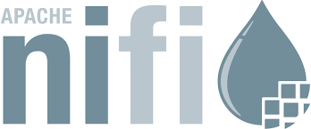

# Big Data Engineering

## NiFi

*The swiss army knife of integration tools. It has many connectors to interact with peripheral systems.*

### Basics

#### History

Created by NSA, stands for NiagaraFiles. They were encountering the same integration problems as a lot of businesses, like how to handle system failure, detect errors in integrations, be the intermediary between systems, prevent bottlenecks, implement things like throttling, keep data quality and consistent between systems, support various protocols (http or message queuing protocols, like Kafka or JMS, or file transfer protocols)., how to integrate new future platforms.

Became top level apache project in 2015. Has drag and drop GUI.

#### Purpose

*NiFi excels at facilitating automated data flow between systems*. 

When we looked at cloud workflow, NiFi is another workflow tool. You drag and drop components then drag arrows between those components to define an automated workflow. Alternatives = mulesoft, Oracle fusion middleware.

##### When to use it

###### Sqoop

For implementing integration between SQL db and hadoop in batch.

##### Oozie

Starting and stopping and processing data, as a job.

###### Oozie vs NiFi

Oozie doesn't integrate with as many components. It's a batch execution engine. We're going to process a lot of data on a schedule, and we're going to have start and end times for the job. It runs, it processes data, it shuts down.

With NiFi, it's a continuous data flow tool. NiFi is always on, always running, and integrating in real-time or near real-time, in an event driven fashion. Maybe waiting for messages on a queue, or as an http server and that we're waiting for http requests to come in.

#### Strengths

It's good at transformation, translation, and routing. All messaging patterns from the integration lecture. Translation between data formats (json -> Avro or Acro to xml).

it's not good for distributed batch compute, or complex event processing meaning (we cant implement 300 steps). Also, not very good at AGGing data. 

It's for processing message by message or event by event, not big batches.

#### Place in big data architecture

Used for the collection, and a bit for the preparation and curation, of data provided by data providers. Also can expose them for consumption by other systems. Writing applications to collect, preparing, and curate or publishing big data to external systems integration.

#### Architecture (repositories, java app, flow files)

It's a Java application. You have a virtual machine (Linux host), running a JVM. Inside that you have all the different NiFi components.

You have a small web server for the http interaction, to host the console.

You have a flow controller which is the data flow you define. In the NiFi console, that gets interpreted by the flow controller. The flow controller is able to send different data to the different steps that you define within the graphical data flow.

So - you have all these different processors as part of the flow controller, as well as any extensions that you've written. 

You have back end repositories, implemented on the file system. They store data three types of data.

1. Flow file repo - stores attributes, or metadata, around flow files. It'll have one flow file record, as well as a metadata around that flow file. When was it received, name of the file, any other header attributes. File with a filename, updates date, created date...
2. Content repo - stores the data for that flow file. The flow file will have a pointer to the backend data. That's essentially the file content (json, avro xml, raw text). The contents of the file.
3. Provenance repo - keeps track of where the flow file was processed, step by step, throughout your data flow. Also any changes made, and different types of of provenance events. Was the content modified? Was it created? Was it deleted? What's occurred throughout the flow?

(This image is used twice intentionally.)

#### Enterprise Integration Design Patterns

NiFi processors typically fall into one of the categories seen in the enterprise integration patterns. 

Messages, Message translators, Message routers,  Message endpoints and Messaging channels.

NiFi does many of the enterprise integration patterns on its own.

### NiFi processor connections  

In a NiFi processor, relationships are called [connections](https://www.tutorialspoint.com/apache_nifi/apache_nifi_processors_relationship.htm). 

When you create a connection between processors, you need to select one or more relationships between them.

Connections are queues which allow processes to interact at different speeds. Because queues are individual, they can dynamically response to data pressure. One under heavy demand can have back pressure applied, which stops the source from sending until load reduces. This still increases load on the upstream processor though, so backpressure can propagate all the way back to source, without [fixes](https://mail-archives.apache.org/mod_mbox/nifi-users/201604.mbox/%3CBLU436-SMTP24995D5F6EDF5985AADFE23CE680@phx.gbl%3E).

#### Relationship output types 

The two output relationship types are success and failure. 

##### Success 

Occurs when a FlowFile processes without error. 

##### Error

If the processor runs into an error (authentication, connection problem, etc), the FlowFile goes to a failure relationship. 

### NiFi  load balancing strategies

NiFi offers [various](https://blogs.apache.org/nifi/entry/load-balancing-across-the-cluster) load balancing strategies.

#### Do Not Load Balance (default)

Data stays on the node it's on.

#### [Round Robin](https://www.holisticseo.digital/technical-seo/load-balancer/) (most common)

Data is evenly distributed across the cluster. Clients submit a request, and it's send to various servers. This method doesn't consider the status of each individual server, but simply cyclically allocates data to them.

#### Partition by Attribute

Allows "like data" to be sent to the same node. The user configures an "attribute name" (e.g. customerID), and FlowFiles with that value are sent to the same node.

#### Single Node (least used)

As as described, all data is sent to a single node. This would be useful when you need to first push all processes to a database, or if you need to merge slow moving data into a larger batch.

### View the FlowFiles enqueued in a Connection

The [steps](https://www.tutorialspoint.com/apache_nifi/apache_nifi_queues.htm) to view the FlowFiles enqeued in a connection are right-click the relationship, and click List Queue. 

As an aside, if there's overload or error, you can then empty the queue. 

### Available processors to perform various tasks

[Source](https://www.tutorialspoint.com/apache_nifi/apache_nifi_processors_categorization.htm)

- Split a text file into multiple smaller text files - [SplitText](http://nifi.apache.org/docs/nifi-docs/components/org.apache.nifi/nifi-standard-nar/1.12.1/org.apache.nifi.processors.standard.SplitText/index.html)
- Route FlowFiles based on their Attributes - [RouteOnAttribute](https://nifi.apache.org/docs/nifi-docs/components/org.apache.nifi/nifi-standard-nar/1.6.0/org.apache.nifi.processors.standard.RouteOnAttribute/index.html)
- Get the attributes of the FlowFile at a specified log level - [LogAttribute](https://nifi.apache.org/docs/nifi-docs/components/org.apache.nifi/nifi-standard-nar/1.6.0/org.apache.nifi.processors.standard.LogAttribute/)
- Add user-defined attributes - [UpdateAttribute?](https://nifi.apache.org/docs/nifi-docs/components/org.apache.nifi/nifi-update-attribute-nar/1.12.1/org.apache.nifi.processors.attributes.UpdateAttribute/index.html)
- Throttle the rate at which data can flow through one part of the flow - [ControlRate](https://nifi.apache.org/docs/nifi-docs/components/org.apache.nifi/nifi-standard-nar/1.12.1/org.apache.nifi.processors.standard.ControlRate/index.html)

### How to create and download a template from a NiFi dataflow

To create and download a template from a NiFi dataflow, you would click-drag to select the components to be part of the template. You then click Create Template, and name the template. Click create. You can then click the top right hamburger menu, template, and download the .xml file using the icon.

### Prioritization schemes

In NiFi, a prioritization scheme determines how data is retrieved from a queue. There are [various schemes](https://docs.cloudera.com/HDPDocuments/HDF3/HDF-3.1.0/bk_user-guide/content/prioritization.html) to choose from.

#### OldestFlowFileFirstPrioritizer (default)

Given 2 files, the older will be processed first. 

#### FirstInFirstOutPrioritizer

Given 2 files, the one which reached the connection goes first.

#### NewestFlowFileFirstPrioritizer

Given 2 files, the one which is newest is the dataflow goes first.

#### PriorityAttributePrioritizer

Given 2 files with a "priority" attribute, the one that's highest priority goes first. 

### Provenance events and types

Meaning, where did the data come from, and how did it change step by step.

First, provenance is [defined](https://en.wikipedia.org/wiki/Provenance) as the chronology of the ownership, custody or location of a historical object. It's originally used in relation to works of art, but now applies to archaeology, paleontology, archives, books, computing, etc.

> The primary purpose of tracing the provenance of an object or entity is normally to provide contextual and circumstantial evidence for its original production or discovery, by establishing, as far as practicable, its later history, especially the sequences of its formal ownership, custody and places of storage.

This sounds relevant to [data lineage](https://en.wikipedia.org/wiki/Data_lineage). 

> Data lineage includes the data origin, what happens to it and where it moves over time. Data lineage gives visibility while greatly simplifying the ability to trace errors back to the root cause in a data analytics process.

Further in the Provenance wiki under computer science heading, it says.

> ...informatics uses the term "provenance" to mean the lineage of data, as per data provenance, with research in the last decade extending the conceptual model of causality and relation to include processes that act on data and agents that are responsible for those processes.

That said, in NiFi, [provenance](https://docs.cloudera.com/HDPDocuments/HDF3/HDF-3.5.1/using-dataflow-provenance-tools/content/data_provenance.html) "is a record of what has happened to the FlowFile."

When monitoring a dataflow, you may need to see what happened to a data object (FlowFile). Nifi records and indexes data provenance details as data flows through it. This means you can search, troubleshoot and research whatever issues may arise. "Each point in a dataflow where a FlowFile is processed is in someway considered a [providence event](https://docs.cloudera.com/HDPDocuments/HDF3/HDF-3.5.1/using-dataflow-provenance-tools/content/provenance_events.html)". 

When data first enters a dataflow, a RECEIVE event occurs. When the data finally exits the flow, it is a SEND event. If the data is modified, there may be a CONTENT_MODIFIED or ATTRIBUTES_MODIFIED event. Finally a DROP event occurs if an objects life concludes.

A data linage would look like this:

### Dataflow optimization 

According to this Apache [ETL blog post](https://blogs.apache.org/nifi/entry/basic_dataflow_design), you can have several disparate dataflows running alongside each other in parallel. The data coming out of source X requires one kind of processing, Y requires another, while Kafka and HTTP provide 2 more. These are separate "stovepiped" dataflows. 

NiFi encourages a way to approach dataflows without this limitation. Rather, you contain several input feeds within the same dataflow, which allows you to route data to "one-off subflows" when needed. When you mix the files into one flow like this, it does make it a bit harder to trace however. In the illustration, we see what those unmerged stovepipes would look like. Notice they all push into HDFS in the end.

Imagine you need to add a new requirement of having the text data put into HDFS 1,000 lines at a time. You would now need to edit each of those stovepipes with the new SplitText() requirement. Time consuming.

Instead, you could merge all flows into one, and apply the same SplitText() requirement at the end, applying to all simultaneously.

So what about tracing a file through the newly merged process? Click on that Data Provenance icon and trace away.

### NiFi's built-in protections against hardware and system failures

FlowFiles are data objects, a data record, which has a pointer to its content (payload) and supporting key/value attributes (metadata such as the FlowFile's filename). Each FlowFile associates to at least one provenance events (a record of what happened to the FlowFile). Each of these parts has a storage repository. 

#### Repos

The repos themselves are immutable, meaning they can't be changed, but only copied and updated. For instance, if a FlowFile's content is changed, the original FlowFile content is read, sent through a transformation, written to a new stream, and the FlowFile's pointer is updated to the new content location.

There are 3 repo types. Each one is a directory on local storage.

##### FlowFile repo

Holds metadata for all current FlowFiles.

##### Content repo

Holds content for current and past FlowFiles.

##### Provenance repo

Holds history of FlowFiles.

#### [Failure Protection](https://nifi.apache.org/docs/nifi-docs/html/nifi-in-depth.html#EffectSystemFailure)

The FlowFile repo acts as a Write-Ahead Log, so as FlowFiles flow through the system, changes are logged in the repo before the transaction occurs. If a node fails, the last datastep is known (check logs) and the process can resume. A delta is captured at every stage, so restoring the process means loading a snapshot and replaying the .partial delta files. The snapshots occur automatically for each FlowFile. 

Copy On Write guards against problems stemming from a node dying mid-write. Since FlowFiles transactions never modify the original file, (there's a pointer to the original), the original is safe. The mid-write is thrown out and removed by garbage collection, and the file is rolled back. 

### NiFi Expression Language functions for various operations

A FlowFile may have an attribute `filename` or `path` or `uuid`. NiFi's [Expression Language](https://nifi.apache.org/docs/nifi-docs/html/expression-language-guide.html#overview) is used to reference these attributes, compare them to other values and manipulate the values. To return the key attribute `filename` as uppercase, you would use the expression `${filename:toUpper()}`.

- Evaluates a boolean expression, returning one value if the boolean is true and another if it is false. - [equals()](https://nifi.apache.org/docs/nifi-docs/html/expression-language-guide.html#equals)
- Returns a subset of a string, starting at a provided start index and ending at an optional ending position. - [substring()](https://nifi.apache.org/docs/nifi-docs/html/expression-language-guide.html#substring)
- Finds and replaces the first instance of a string with a replacement string. Also supports regular expressions. - [replaceFirst()](https://nifi.apache.org/docs/nifi-docs/html/expression-language-guide.html#replacefirst)
- Takes a URL-encoded string and returns the decoded, human-readable value. - [urlDecode()](https://nifi.apache.org/docs/nifi-docs/html/expression-language-guide.html#urldecode)

