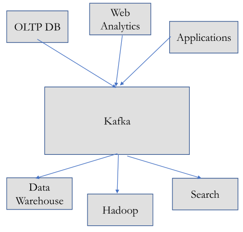

# Big Data Engineering

## Kafka - for Streaming Data

Kafka is not an integration tool, like Nifi. 

Kafka is a message broker. It has Kafka Connect, an integration layer with some connectors, but it wasn't built for connecting to, collecting from and handling distributed applications the way NiFi was. Kafka is a message broker.

Kafka Connect and Kafka Streams are just components added on to Kafka core message brokering functionality.

### Kafka history, purpose, and place in the Big Data Reference Architecture

LinkedIn product, used as an internal streaming platform. Create by Neha Narkhede and Jay Kreps.

Created to power real-time applications and data flow behind their website (users interacting with pages, doing things on those pages, clicking articles, sending messages, likes, etc). It processes data as a continually growing stream, rather than processing data stored in a database. Actions that users perform get sent to a message queue, and that stream grows very quickly over time. High velocity. Events are generated frequently (petabytes of data consumed by the kafka cluster daily). 

Went open source on Github late 2010. Became top level apache project 2012.

Kafka is strictly for messaging. Publishers add on a topic, consumers take from that topic. 

### Why Kafka

Kafka is useful primarily for the messaging aspects. Before NiFi, we looked at Enterprise Integration Patterns and Messaging Patterns. Kafka is a messaging channel, offering message queues, or topics, for publishing message streams, or event streams, and making those available to subscribers. It makes it suitable for processing streaming data (tracking activity on a website, or collecting metrics or logs - again, sort of time based messages or data coming in, etc.

Above is LinkedIn's ecosystem. There are various Kafka clients, integration with hdfs to get messages directly into hdfs, as well as a mirror-maker (a separate Kafka cluster that replicates from this first cluster - it can be remote right for geospatial redundancy, for DR scenarios, or local serving of content, keep data closer to consumer).

### Message brokering in general

#### Pub/Sub Message Pattern

Kafka uses the Pub/Sub Enterprise Integration Messaging Pattern.

You typically think of message queues as being an intermediary between only two systems. One publisher, one consumer. 

Contrast that with the Publish Subscribe pattern and topics. That's typically one publisher and multiple subscribers/consumers. So as a publisher, i'm just putting the data on a topic, I don't care where it goes. On the other side, the consumption side, there could be several consumers connecting to that same topic (0+). Kafka facilitates an infinite number of of consumers. No hard limit to subscriber count.

##### Message Broker

The broker is Kafka. You'll see many Kafka brokers in a cluster. 

#### Message broker alternatives

Alternative message brokers include JMS Queus/topics, AMQP, RabbitMQ, MQTT (mosquito). Kafka has more performance, scalability, additional features (Kafka connect/streams).

#### Streaming alternatives

Apache Samza, Storm, Flink, *Spark Streaming*.

### Advantages of messaging in integration (point to point vs publish/subscribe) 

### Streaming Data

Real-time systems, and particularly real-time operating systems, in computer science are rigidly defined.

Traditional real-time systems, or hard real-time systems, are things like guided missiles, pacemakers, anti-lock brakes. There's a critical failure if there's a delay in in processing and moving of data around and executing procedures.

Soft real-time, if latency increases, functionality degrades. Still usable, but annoying.

Near real-time is a dashboard from 5 minutes ago. System log aggregator. 

Herman Kopetz'  [Real Time Systems](https://www.amazon.com/Real-Time-Systems-Principles-Distributed-Applications/dp/1441982361) says:

There are a few classifications of streaming data.

| Classification | Examples                                                     | Latency measured in         | Tolerance for delay                                 |
| -------------- | ------------------------------------------------------------ | --------------------------- | --------------------------------------------------- |
| Hard           | Pacemaker, anti-lock brakes                                  | Microseconds - milliseconds | None - total system failure, potential loss of life |
| Soft           | Airline reservation system, online stock quotes, VoIP (Skype) | Milliseconds - seconds      | Low - no system failure, no life at risk            |
| Near           | Skype video, home automation                                 | Seconds - minutes           | High - no system failure, no life at risk           |

A **data stream** is an abstraction, representing an unbounded (infinite and ever growing) dataset. It's unbounded bc over time, new records keep arriving.

Unbounded data is not like a table. It might have 100 rows, it might not. It's more an expectation that a topic will be updated continuously.

A streaming data system = a non-hard, real-time system that makes its data available at the moment a client application needs it. It’s neither soft nor near - it is streaming. That's seen in Spark Streaming. It's just continuous processing of data coming in...not necessarily event-by-event processing. You still have window functions, where topics come in for 5 minutes, then you run a batch. There's an ordering of incoming data points.

Imagine you have a purchase order created by a user. Then the user modifies that same order. From a streaming perspective, that's two separate events, and it's up to downstream clients to decide what to do with those downstream consumers. So over the course of an order, you might have an order created events. an order modified events, an order cancelled event, but you still maintain them as three separate events, occurring at different times.

You can also replay event streams for a period of time. Say you have some critical error and processing that order I can go back in time to a point, in that queue, maybe a day prior. You can replay them in the order they were received.

Old fashioned way to handle data streams:

The DW has a transactional database, a CRM, some web analytics, etc. All of these are interacting with each other directly. 

What happens when one of these goes down? If the order system is down, then the logistics application is also likely down, because they directly connect.

Better way, using Kafka:

**Decoupling**. If you put Kafka in the middle, it shields the application from dependencies on other applications. So, if all these applications are instead producing messages or consuming messages, they're effectively decoupled and don't have to connect directly to to the other systems. That helps build resiliency, because if if the data warehouse goes down, for instance, the web analytics application won't know, because from it's perspective, it just won't see any data on the topic for a while.

**Security**. Also has beneficial from a security perspective. One - you don't have to include endpoints and connection strings between all these applications. **Two** - you can shield your applications from incoming connections. e.g. MQTT and a manufacturing plant. You just write a script or a process that connects to the plant environment, and it pulls back some data every morning. That's the security vulnerability. Anytime you have incoming connections to your manufacturing side, people could potentially exploit that. 

It's much safer to use outgoing connection, so instead, within your plants network, you could have an MQTT client publishing data out. That drastically reduces the potential of a security vulnerability.

### Kafka Overview

Kafka is a a Java application that is

- real time
- distributed (add more boxes to increase performance)
- publish and subscribe messaging system
- scalable
- high availability
- built to store and persist data
- lets you compute derived streams dynamically

#### When to use it

Messaging - If you have applications interacting via messages.

If you're tracking sensors or website activity.

Collecting metrics like CPU or memory usage, or streaming log files.

Performing an audit to detect fraud.

Source and target of stream processing.

#### When not to use it

End user application, high code environment

Data transformations between diff formats

Don't have readymade producers and consumers...kafka has a producer api and consumer api, but they're not ready made.

Kafka is not as GUI as NiFi. It's more coding involved.

#### Where it fits in big data reference architecture

Within the big data reference architecture Kafka topics would be providers or consumers within a big data application. You write code that either consumes data from a Kafka topic from the big data environments or big data application. You'll also write providers that publish data to the big data application, so that you can use other framework components (streaming compute) to process the data in a pipeline.

The big data framework also uses Kafka for distributed messaging. The Kafka cluster could reside on data nodes potentially, for hadoop type stuff.

Kafka helps with:

Message brokering: reducing P2P integration and offering a re-usable message bus.
Streaming: streams enables native stream processing
Connect: also offers adapters for connecting to sources and sinks

#### Protocols

From an integration perspective, Kafka does have an http interface. Kafka natively uses the Kafka protocol, but it does facilitate publishing messages, data or retrieving data over http. So, you can use generic web services to interact with Kafka. The reason that's important is the Kafka protocol is very specific to Kafka, whereas web services are the ubiquitous way to perform integration and also it encompasses standards like authentication (OATH). Also translates xml to json through http headers, etc. So internally, it uses Kafka protocol, but it does have a lightweight http wrapper that can be used for RESTful web services used for interacting with Kafka (for publishing/consuming messages, checking offsets, etc).

### The message

The message is the unit of data in Kafka. It might come with additional metadata, aka a *key*. Messages are written in batches (collection of messages, all with being produced to the same topic and partition).

There's a trade-off between latency and throughput. If the batch is bigger, more messages can be handles per unit of time, but messages become slower.

Batches are usually compressed, boosting data transfer and storage a the cost of CPU.

### Topics and Partitions

Messages are categorized into **topics**. Those are further sliced into **partitions**. Partitions are the way Kafka provides redundancy and scalability.

Messages are added append-only, and read from 0 to n. 

Within a single partition, you can be sure that a message is ordered by time across a topic. Outside the partition, there's no such promise.

### Producers

Producers *create new messages published* to a specific topic.

Sometimes, the producer will direct messages to specific partitions by using the message key.

### Consumers

Consumers read messages. A consumer subscribes to one or more topics and reads messages in the order they were produced. They track which messages they've consumed with the offset of messages.

The **offset** is metadata that Kafka produces.

`message_count += 1`

offset = 0. offset = 3. offset = 23,321. It's just an Int that keeps counting up.

Each message in a partition has a unique offset. Zookeeper or Kafka tracks the offset of the last consumed message, so a consumer can stop and restart without losing place. 

### Consumer groups, partition offsets

Consumers work as a part of a consumer group. Groups ensure that each partition is consumed by one member, which owns the partition. Consumers can scale horizontally to consume larger topics. If any consumer fails, the group will take over the partition.

### Brokers

A kafka server. 

It receives messages from producers, assigns them with an offset, and commits (saves) messages to disk.

"I'll take that message. Looks like it's message #453. I'll save it here."

It responds to consumers' fetch requests for partitions, and responding with messages that have been committed to disk.

### Kafka cluster architecture

Brokers work in a *cluster*. Inside a cluster, one broker serves as the controller. 

The *controller* does admin stuff. Assigns partitions to brokers, monitors for broker failure.

Each partition is owned by a single broker, which is the partition's *leader*.

Finally, a partition can be assigned to many brokers, which results in the partition being replicated.

### Kafka protocol

Kafka has its own (near application layer) protocol that runs on TCP. It renegotiates failure if a node is non-responsive. Also handles the request/response lifecycle and associated errors, offers security, throttles, etc.

### Zookeeper in Kafka

Historically, zookeeper was used to store partition and offset info. In later releases, a special topic can be used to store that info.

Kafka keeps track of consumer partition offsets. When consumers connect, they can resume consumption where they left off.

### High availability

When producers send messages to a topic partition, the message is appended in order sent. Consumers see messages in the order they're stored in the log.

A message is *Committed* when all *in-sync replicas* (ISRs) for that partition have applied it to their log. A committed message won't be lost if there's at at least one living in-sync replica.

#### From the client's perspective

Producers:

- wait for all ISR to "ack"
- wait for leader to "ack"
- Don't wait

Consumers:

- Messages written to all ISR are committed
- can only read committed messages
- read all messages

### sendFile

In Linux, everything is considered a file, including files and I/O devices like network adapters, drives, etc.

Kafka uses `sendFile` to avoid buffering messages between kernel and user space. 

> `sendFile` takes one file descriptor (a handle to an actual file) and pipes it to another fd (a network socket) all with one system API call and no need to buffer data through user space.

I don't know what this means...

### Microbatching

Takes transactions over a time period, and combines them into a single transaction. This reduces connection overhead by reducing chattiness. It also makes compression better for outward data.

### Small JVM

The amount of data stored in the Java Virtual Machine (heap space) is extremely minimal. The JVM is used for execution, but Kafka writes transaction logs straight to disk.

This means: There's overhead storing and garbage collecting java objects...eh...there's limited memory allocated to the JVM. 

### The problems Kafka solves

Kafka achieves **parallelism** and maintains **message order**. This is difficult in messaging systems because usually, two consumers on one event stream will result in **race conditions**. 

"Which message do you processed first?"

By allowing consumer groups, but restricting to at most one consumer per partition, means message order within a partition is guaranteed, AND YOU STILL get high availability and parallelism.

Also, the producer-consumer (or bounded buffer) problem exists when synching messages between them. 

A bounded buffer will eventually fill up if the consumer goes down. So where would the producer put messages? This is usually fixed by having the producer and consumer talk. If the buffer's full, the producer sleeps. Once the consumer clears some buffer space, it wakes the producer back up.

The big data nature of Kafka circumvents this problem. The buffer size is big enough for Kafka to save data for an extended period of time. 

Additionally, since Kafka is managing consumer partition offsets, consumers can go down for extended periods of time and resume where they left off.

### Kafka Connect

The creators of Kafka founded Confluent, which helps maintain Kafka today. It's open source. They create connectors for JDBC connection to RDBs. Interactions with hdfs. Connectors to key value stores. Adapters for other indexed text sources as well.

### Kafka Streams

A **lightweight client library** which can be embedded in any Java application, and integrated into existing packages. It helps you deploy and operate streaming applications.

There are no external dependencies.

Supports fault-tolerant local state, which means very fast and efficient stateful operations, like windowed joins and aggregations.

A **stream processing application** is a program that uses Kafka Streams library.

A stream processor is a node in the processor topology. It's a processing step for transforming data in streams. It takes one input record, applies an operation, and might produce one or more output records.

## first 48 minutes of lecture complete