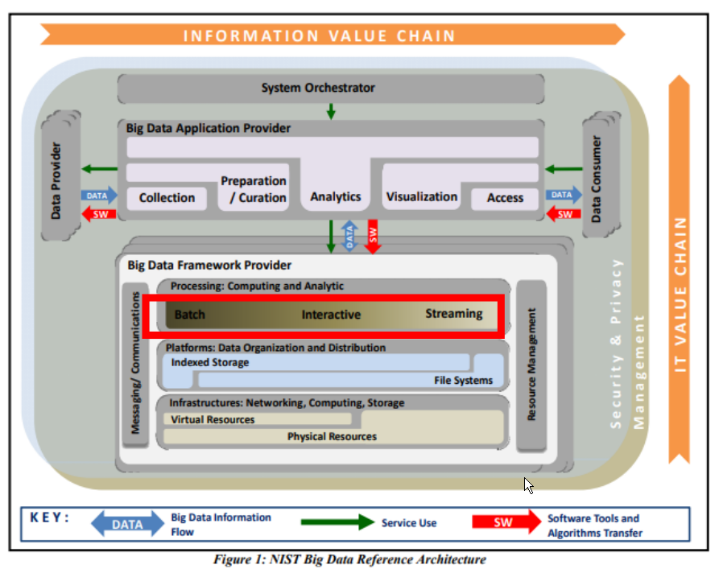

# Big Data Engineering
Garth Mortensen

## Spark Intro

This is about the differences between some of Spark's data set abstractions, particularly the resilient distributed data (RDD), the dataframe, and the dataset. Then, deep dive RDDs to see some of the development and compute you can achieve at scale using spark. Then general spark, and why it's written in Scala. NiFi, MapReduce (Sqoop), Oozi, HDFS are written in Java. After RDDs, the focus is on how to use them, and different spark utilities used to submit spark jobs. Later, spark streaming. Kafka is made for streaming data (the message broker), but spark also handles streaming. Spark is the streaming compute to analyze the content as it comes off of Kafka topics. Also, spark SQL. 

### General

#### History

Hadoop MapReduce was a 2005 open-source implementation of the MapReduce paradigm. It wasn't as performant as it could be though. 

Apache Spark was open-sourced in 2010 by UC Berkley. It has largely superseded MapReduce for big data processing because it has better performance, submodules (MLib, Spark SQL, Spark Streaming, GraphX) and dev support in open source community. Also you can facilitate both streaming and batch compute. Same code can be used to write both streaming and batch jobs, which is unusual. 

Apache spark is a unified compute engine again massively distributed for parallel data processing on clusters. Every tool explored so far is highly distributed...

Unified = one more spark API or foundation with extensible features being built around the base. All the peripherals are unified bc they use the same foundational apache spark platform.

Compute engine = it's in the big data reference architecture. You typically seperate compute, network, storage into diff categories. If you look at a VM, you allocate those resources. Spark is for distributed compute, which makes it suitable for analyzing data in memory. You can also query it like a db. But it's more compute.

Libraries/modules = (sql, spark ml, structured and spark streaming, graphx...) are all useful

#### Big Data Framework

Spark performs massively scalable computations and analytics within the big data framework. So you submit spark jobs to the cluster, like sqoop and oozie jobs. You deliver the code and software artifacts to the cluster. Batch is for executing a simple spark job, on demand or on a schedule. Streaming is more always on, microbatching data, AGGing it on the way in, using window functions, maybe processing 10 messages or megs at a time. 

More Error Correcting Code ram (ECC) is desirable for Spark, since you're writing more to memory. RAM isnt the most consistent storage option. The density of the components cause challenges. Eventually cells get overwritten when you don't intend for them to get overwritten. That's the nature of "spillage", which isn't the correct term, but essentially a charge spilling over from one cell to the next accidentally charging another cell in RAM. There are considerations on the infrastructure...you're going to want more memory...you might want ECC RAM....also GPUs for Spark ML. Spark can run fine on commodity hardware, but if you're managing the infrastructure or specing it on the cloud, then pursue getting more RAM (16/32 per node).

Data Bricks has "Platform As A Service" spark clusters. You basically select a prebuilt configuration offered by data bricks, and if you do that, you can bet that there's hundreds of other customers using that same configuration. They run on pre thousands and thousands of clusters, as opposed to ACME company running 1.

Interactive is more like an ad-hoc query submitted from a client, and you get an interactive response. The results are up to date, but become stale. Like a SQL query.

#### Alts

MapReduce came before, still can be an alternative. Tez can do a backend computation engine for tools like Hive.

Spark is faster than MapReduce. MapReduce stores intermediate results on disk. Spark stores it in memory. Spark defines workflows as DAGs, like Oozie, but also optimizes it by reordering it, though not changing the output but the sequence that diff operations are executed. Spark SQL is a good metaphor to compare to RDBs. There is a Catalyst Optimizer in Spark. Similar to how a db optimizer takes a query and builds an execution plan and reorders operations into something more efficient, like a filter first or join on a smaller table first, to get rid of a lot of data early, Spark does the same thing. Gathers stats on datasets, makes runtime decisions about most effective way to execute a graph based on the data sets used. Stats = how many rows in the table, how many values reside in a range, how many are null.

#### Running Spark

Distributed computing is never an easy thing to set up, and when these Open Source projects are built, they're not always built with usability in mind. However, you can download and installing Apache Spark on your PC, run it within the Cloudera QuickStart Docker container, or a web-based version in Databricks Community Edition.

### Data Abstractions

#### Resilient, distributed dataset (RDDs)

When spark was introduced in 2010, RDDs were used. Not very developer friendly, if you're coming from Object Oriented or SQL background, they'll be different. They're functional in nature. There are specific functions you can call on RDDs to perform distributed operations...like maps, reduces. They are objects that can be mapped in an RDD...

#### DataFrames (dfs)

Essentially an untyped dataset (not serializable as a Java object/no defined schema, no static list of attributes and columns attributed to dfs). 

Introduced in Spark SQL, so leverages Catalyst SQL Optimizer to optimize ops on dfs. You can submit queries using SQL or the dataset API. They're both similar, very SQL like. If you use the API, you're doing it in a traditional programming fashion, like an object oriented language, using .select or .where. With SQL, you write ANSI sql statements and submit it to spark. 

You don't specify partitions. Spark does that. RDD you can set specific partitioning rules. Spark does that auto with dfs. An example of partitioning would be 

You would store data together, based on certain partitioning strategies, or rules that you specify. For instance, you might partition by date, and then all the rows around a particular date would be in the same partition, maybe at the month level. So you can partition by month and then have all the September rows from this year together, then all the October rolls from this year together.

#### DataSet

Data sets are strongly typed meaning each role in a data set is going to have an object definition that you can use to serialized object. 

All the same benefits of sort of untyped versus typed objects. If you have it typed, you can do more type checking at compile time, you can also put more security bounds around it with respect to buffer type attacks (buffer overflow). It too uses the the Catalyst SQL Optimizer, the SQL API, the dataset API. 

It'll have a bunch of lazy transformation similar to resilient distributed data sets. 

### RDDs

RDDs are immutable partition collection of records that enable parallel operations, typically across machines in a cluster. 

They're not very feature rich. You'll have to do things like splitting text and reordering and partitioning on your own.

So why do we learn it? It's still the only option for dealing with unstructured data like text. It's certainly performant for certain operations, again it just it might take a little more tuning to get there. If you're an expert spark developer, you might actually use it for that reason. It gives you more fine grained control over partitioning. 

As a general rule of thumb, if you're dealing with unstructured data, you might have to use RDDs. If you're dealing with structured or semi-structured data, DFs are usually the better option. 

Note that you can kind of arbitrarily convert between these different types of data abstractions, so you always start with a context. 

It encapsulates the details of your cluster, so that you can submit a job to your cluster, call operations on the cluster, create a new object on the cluster (such as an RDD). If you're creating an RDD from the Spark Context, that would be done using parallelize. You can call that parallelized on a file to read a file into an RDD. From a SQL Contexts perspective, you'll be using SQL Contexts that read a .csv, .json, .avro, or a parquet file. 

You can also just use a generic create Dataset if you wanted strongly typed rows. 

1:40m Data frame to dataset similarly is fairly simple since dataset is typed and a dataframe is untyped, you can simply call to def on a dataset to convert it to a dataframe.

### Spark Architecture

This is what Spark runtime looks like.

Context acts as an interface to spark features and you can specify a Spark Context and your code. If you're doing development using databricks or using pyspark, the context will typically be provided to you. 

You're submitting jobs to a cluster manager, that can either be YARN, or it can be the standalone spark cluster manager. 

Similar to the master node in hadoop, except now everything typically uses YARN.

Typically if you already have yarn in your cluster, it's a better idea to use yarn. If you have a standalone spark cluster, it's better to use the the standalone spark cluster manager. 

There's also worker notes, these would again be JVMs running on on some infrastructure. There's a cache included, and there's also cache for the data, as well as an executor to run the compute and operations on the particular data abstraction that you're using. 

This is a spark cluster. You could have multiple jobs running at the same time, manifested as different tasks within the jvm. So that's why you have multiple executor tasks running within the jvm at a particular point in time. This shows a two node cluster with the cluster manager. 

Note that data is available to all tasks within that executed, although it would be a subset of a distributed dataset. The tasks operate on a subset of that subset. 

A job is broken down into multiple stages when logging, sort of map and reduce stages, with some dependency implied. The output of one stage becomes the input to another. 

You can submit code interactively using the spark Shell using an IDE (Eclipse and maybe Netbeans are popular) or using databricks. 

Alternatively, you can compile your executable. That could be a Java archive in the case of using the Scala API for spark. You can submit those using the CLI spark submit, or using tools like Oozie. So there's different ways of interfacing with the cluster. 

Spark was written in scala, which is important. Backend features of scala and Java lent themselves well to distributed computing into particularly distributed computing on large datasets in sort of a functional manner. 

Some well known scala of features - it compiles into Java bytecode and it's made to run within a jvm. So it's similar to Java from an architectural perspective in that it compiles into bytecode that can be run in a jvm. 

Scala is purely object oriented, meaning that everything is treated as an object. Functions are first class objects in scala. Simple types are objects, so there really are no simple types, even a string is an object. Objects are also objects.

But, it does facilitate functional programming, it has features of a functional language. So even though it is a purely object oriented language, it does facilitate multiple paradigms, particularly object oriented and functional programming, which are two separate in very different paradigms. 

### Functional Programming

You've probably done functional programming at one point or another. If you're writing excel functions, doing a vlookup or doing an if with another nested function inside, that is that is functional in nature. 

### Word Count MapReduce

### Spark Transformations, actions, lazy execution

Defining transformations (map, reduceByKey, groupByKey, join, union) does not trigger code execution. A series of transformations only define a directed, acyclic computation graph that later become a stage.

Spark only executes when an action (collect, count, reduce, saveAsTextFile, take) is taken.

This helps in optimization. Multiple steps in a Spark job may be re-arranged to deliver the same output, but optimize the order in which steps are executed.

#### Transformations

There's 2 types of transformations.

Narrow = it's done within a partition, meaning that the transformation can happen within a partition without needing to know anything about the other partitions. 

Wide = spans partitions. Those would be the group by and the reduce by operations. You can't execute the transformation row by row. It has to be applied at an aggregate level across partitions. 

#### Lazy Evaluation

Helps in optimization, giving spark an opportunity to look at the graph as a whole, before executing it.

#### Actions

Actions trigger execution. This sends your program then to the spark cluster for for execution.

### Spark Shell

You can use a spark Shell to interactively execute spark, using a REPL interface (read execute print loop). 

### Spark Submit

Spark submit would be taking a spark job that you've built, in a Python script or in a compiled Java archive. You could submit those using the spark CLI to the cluster and you would just define either the JAR or the Python script or whatever artifacts.

### Scala, Java, PySpark, SparkR, Spark SQL APIs

There's different options for APIs. Scala and Java APIs are a very popular. It's written in Scala, so it gets the new features first. Java will have those features early as well.

Pyspark would be a fast follower. It's a Python interface to Spark. On the backend, spark is written in scala, so you're submitting a job to a Scala cluster, essentially that are going to run a jvm. But since you're invoking the spark API, the client library, all it does is really define the graph and then submit that graph to spark and then spark decides how to run an executed within its scala based framework. 

There's even R API for spark called SparkR.

Spark SQL is another way to interact with spark this be a very feature rich SQL implementation, made to run on on data frames, in particular. You can use the spark SQL API to query RDDs, but you can use it to query dataframes and datasets.

### Streaming

There's a couple ways to do streaming in spark but the architecture is kind of the same. You have incoming streaming data that you need to process and a streaming fashion, you can do so leveraging either spark streaming or even structured streams. The difference between spark streaming and structured streams, is essentially the difference between our RDDs and DFs. Spark streams use RDDs as the stream abstractions, you'll break an incoming stream into sort of smaller RDDs. Structured streams will treat them more as a strongly typed table, like a DF, essentially a growing data frame - an unbounded DF. 

Data sources for spark streaming - we covered Kafka...there's a lot of other options. It can interface with both static and streaming data sources independently, which is good if you want to be able to merge incoming data streams in spark. It can interface with things like MLLib to train models with live data. 

