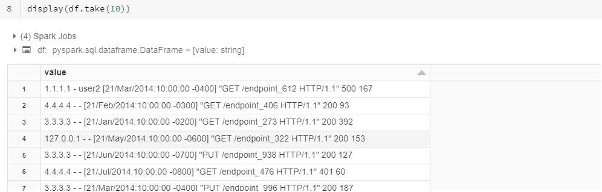
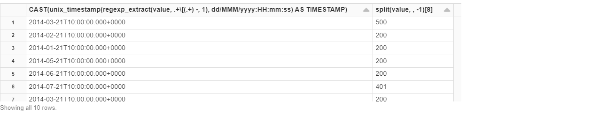

# Big Data Engineering
Garth Mortensen

## Spark Streaming

Leverage [Databricks](https://community.cloud.databricks.com/) and Spark Streaming to analyze web server logs, using this guide: https://docs.databricks.com/spark/latest/structured-streaming/demo-notebooks.html#structured-streaming-python

### Read data

```python
import re
from pyspark.sql.types import *
from pyspark.sql.functions import *

inputPath = "/databricks-datasets/sample_logs/"
df = sqlContext.read.text(inputPath)
```

### Reading logs into streaming stream

Screenshot the results.

1. Display the original log entries.

   ```python
   display(df.take(10))
   ```

   

2. Explain what regexp_extract is doing.

   Nested inside is [`regexp_extract`](https://spark.apache.org/docs/latest/api/python/reference/api/pyspark.sql.functions.regexp_extract.html), which extracts a regex matched group from a string column. Here, there is one single column named Value which is being read in. 

   Regex:

   `.` catches any character except for a new line

   `+` catches one or more of the preceding token, which here is `.`

   `/[`is an escape to capture left bracket. Here, we capture the left bracket in the timedate field

   `()` is to capture the first group, which I think distinguishes between what comes before and after the -

   `.` inside the parentheses captures any character, and plus extends it to many.

   *Combined, those tokens together capture the bracket-denoted timestamp.*

   `split(df["value"], " ")` takes the singular column Value, and splits it on spaces into 9 elements.

   `[8]` takes the 8th element, which is the HTTP reponse status code.

   ```python
   # it should actually be MMM
   converted = df.select(unix_timestamp(regexp_extract(df["value"], ".+/[(.+) -", 1), "dd/MMM/yyyy:HH:mm:ss") /
                         .cast(TimestampType()).alias("timestamped"),
                         split(df["value"], " ")[8].alias("code"))
   
   display(converted.take(10))
   ```

   

3. What role does unix_timestamp function play in this date conversion? Where did the "dd/MMM/yyy...." string come from?

   `unix_timestamp` converts the string into a unix timestamp.

   MM displays the numeric month, whereas MMM [displays](https://stackoverflow.com/a/38628007/5825523) the short name (e.g. Apr).

4. What is the significance of the final call to cast?

   It displays the int as a timestamp.

5. The above code snippet reads data into a regular Dataframe. Instead, read it into a structured stream. Share your code here.

   ```python
   
   ```

   

6. Give your two output columns a descriptive name. What function did you use to give them a new alias? What did you name them?

   ```python
   .alias("timestamped")
   .alias("code")
   ```

7. Affirm that you are using Structured Streams by checking the isStreaming attribute on your Dataframe.

   ```python
   # Static vs Streaming?
   initialDF.isStreaming
   ```

### Query your structured stream

1. Query your structured stream, filtering only error HTTP response codes (codes greater than or equal to 400). Display the top 10 records. Share your code and output here.

   ```sql
   %sql 
   select 
   	code
       , date_format(window.end, "MMM-dd HH:mm") as time
       , timestamped 
   from initialDF
   where code >= 400
   order by 
   	time
   limit 10
   ```

2. This time, use the same filter but also perform a group by using a window function. Group by HTTP Status code, use a 1-hour window, and take the count. Share your code here.

   ```sql
   %sql 
   select 
   	code
       , date_format(window.end, "MMM-dd HH:mm") as time
       , timestamped 
       , count(*) as cnt
   from initialDF
   where code >= 400
   group by code, time
   order by cnt
   ```

3. Format your output as a histogram, using HTTP Status Code in the legend. What seems to be the most common HTTP error code?

   ```sql
   %sql 
   select 
       timestamped
       , code
       , date_format(window.end, "MMM-dd HH:mm") as time
   from initialDF
   where code >= 400
   ```

   The most common error code is ____.