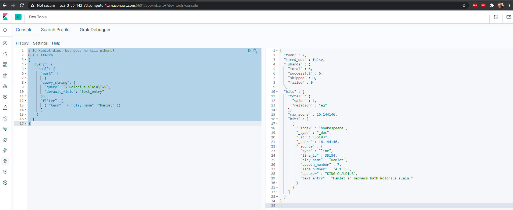

# Big Data Engineering
Garth Mortensen

## Elasticsearch

### Basics

#### In three sentences or less, explain how a content search task differs from analytical queries executed on a columnar data store.

Analytical queries are much more structured, where you can explicitly define a cross section of information using classical search tools like SQL. Content search requires a different set of tools to search through a trove of text, and determine the appropriateness of all text to your search terms. Content is housed not in tables, but in jsons and other nested documents.

#### Name three useful features that Lucene offers for processing text.

Lucene allows:

1. Logical, wildcard and fuzzy searches.
2. Proximity searching, where word X and Y appear within N characters.
3. Scoring/similarity/matching with the Lucene Conceptual Score.

#### What is the top-level Apache search server that is considered an alternative to Elasticsearch?

Apache Solr is the top level Apache search platform (built on Lucene) alternative to Elasticsearch. 

#### Explain the intuition behind both the term frequency and the inverse document frequency calculations in a TFIDF similarity score. 

The term frequency shows how often a word appears within a document, relative to the document's word space. A 2 word document that says "BOMB DEFUSAL" is only about defusing bombs, whereas if the document is 10,000 pages and the phrase appears once, it is likely not a relevant guide. The inverse document frequency reveals how common the phrase is across all documents. If you're interested in the word "common", you're bound to find it in nearly all documents. If you're looking for "inaureoled", you'll likely not find it spread across many.

#### In simple terms explain what this Lucene query was written to find: “information retrieval”~12

It searches for where the two words "information" and "retrieval" appeared in the document within 12 words of each other.

#### Describe Beat’s role in the Elastic Stack. How does this differ from Logstash?

Beats runs on edge nodes (remote machines), and sends information back to Elasticsearch, which stores the data. Logstash runs on the central server, and receives information from Beats edge nodes. It collects, transforms, filters and puts info into a stash. Combined with Kibana, the three can be used to monitor and log infrastructure.

#### Name and describe two different data producers available in Beats.

Beats can produce heartbeats to see if an edge node is healthy, or produce windows/linux logs.

#### If you wanted to exclude documents in Elasticsearch from being ranked in a query, would you use the query context or the filter context?

Query context finds matching documents and ranks them. Filtering documents out is achieved using filter context:

```json
"filter": [ 
    { "term":  { "play_name": "Hamlet" }}
```

### Search queries

Explore the Shakespeare dataset using three new queries of your choosing. Make sure each query returns some results. For each: Explain the query in human terms (what are the conditions that affect coring and filtering, what is the query searching for overall) and provide a screenshot of the query and result.

#### Query 1 explanation

Find the famous quote of "to be or not to be, that is the question", by filtering on the play Hamlet and searching for those terms. It returned 6 successful matches, with a very high top score, which diminishes with the second closest match.

```json
# find to be or not to be
GET /_search
{
  "query": { 
    "bool": { 
      "must": [
          {"match": {"text_entry": "to be or not to be that is the question"}}
        ],
      "filter": [ 
        { "term":  { "play_name": "Hamlet" }}
      ]
    }
  }
}


{
  "took" : 4,
  "timed_out" : false,
  "_shards" : {
    "total" : 6,
    "successful" : 6,
    "skipped" : 0,
    "failed" : 0
  },
  "hits" : {
    "total" : {
      "value" : 2254,
      "relation" : "eq"
    },
    "max_score" : 28.931799,
    "hits" : [
      {
        "_index" : "shakespeare",
        "_type" : "_doc",
        "_id" : "34229",
        "_score" : 28.931799,
        "_source" : {
          "type" : "line",
          "line_id" : 34230,
          "play_name" : "Hamlet",
          "speech_number" : 19,
          "line_number" : "3.1.64",
          "speaker" : "HAMLET",
          "text_entry" : "To be, or not to be: that is the question:"
        }
      },
      {
        "_index" : "shakespeare",
        "_type" : "_doc",
        "_id" : "34416",
        "_score" : 18.27449,
        "_source" : {
          "type" : "line",
          "line_id" : 34417,
          "play_name" : "Hamlet",
          "speech_number" : 5,
          "line_number" : "3.2.44",
          "speaker" : "HAMLET",
          "text_entry" : "question of the play be then to be considered:"
        }
      },
...        
```

#### Query 2 explanation

I don't know anything about these plays. Does Hamlet die? Search the play for dead/slain/etc in Hamlet. It finds a mediocre match, probably because I threw so many match terms in.

```json
# what happens to hamlet?
GET /_search
{
  "query": { 
    "bool": { 
      "must": [
          {"match": {"text_entry": "Hamlet dead slain poison killed murdered"}}
        ],
      "filter": [ 
        { "term":  { "play_name": "Hamlet" }}
      ]
    }
  }
}


{
  "took" : 2,
  "timed_out" : false,
  "_shards" : {
    "total" : 6,
    "successful" : 6,
    "skipped" : 0,
    "failed" : 0
  },
  "hits" : {
    "total" : {
      "value" : 130,
      "relation" : "eq"
    },
    "max_score" : 16.044605,
    "hits" : [
      {
        "_index" : "shakespeare",
        "_type" : "_doc",
        "_id" : "36567",
        "_score" : 16.044605,
        "_source" : {
          "type" : "line",
          "line_id" : 36568,
          "play_name" : "Hamlet",
          "speech_number" : 128,
          "line_number" : "5.2.324",
          "speaker" : "LAERTES",
          "text_entry" : "It is here, Hamlet: Hamlet, thou art slain;"
        }
      },
      {
        "_index" : "shakespeare",
        "_type" : "_doc",
        "_id" : "35183",
        "_score" : 14.999498,
        "_source" : {
          "type" : "line",
          "line_id" : 35184,
          "play_name" : "Hamlet",
          "speech_number" : 7,
          "line_number" : "4.1.35",
          "speaker" : "KING CLAUDIUS",
          "text_entry" : "Hamlet in madness hath Polonius slain,"
        }
      },
...
```

#### Query 3 explanation

Find within 5 words where Hamlet and slain appear, meaning he could be a murderer himself. I don't know the story, but the there was one match indicating Hamlet is a murderer.

```json
# Find evidence that Hamlet is also a killer
GET /_search
{
  "query": { 
    "bool": {
      "must": [
        {
      "query_string": {
        "query": "/"Polonius slain/"~5",
        "default_field": "text_entry"
      }}],
      "filter": [ 
        { "term":  { "play_name": "Hamlet" }}
      ]
    }
  }
}


{
  "took" : 2,
  "timed_out" : false,
  "_shards" : {
    "total" : 6,
    "successful" : 6,
    "skipped" : 0,
    "failed" : 0
  },
  "hits" : {
    "total" : {
      "value" : 1,
      "relation" : "eq"
    },
    "max_score" : 16.144146,
    "hits" : [
      {
        "_index" : "shakespeare",
        "_type" : "_doc",
        "_id" : "35183",
        "_score" : 16.144146,
        "_source" : {
          "type" : "line",
          "line_id" : 35184,
          "play_name" : "Hamlet",
          "speech_number" : 7,
          "line_number" : "4.1.35",
          "speaker" : "KING CLAUDIUS",
          "text_entry" : "Hamlet in madness hath Polonius slain,"
        }
      }
    ]
  }
}
```



#### Inspirational queries

```json
# all indices
GET /_cat/indices

# get all
GET /shakespeare/_search
{
  "query": {
    "match_all": {}
  }
}

# distinct line count
GET shakespeare/_search
{
  "size":"0",
  "aggs" : {
    "distinct_play" : {
      "terms" : { "field" : "play_name" }
    }
  }
}

# filter for othello
GET /_search
{
  "query": { 
    "bool": { 
      "filter": [ 
        { "term":  { "play_name": "Othello" }}
      ]
    }
  }
}

# beware of jealousy in othello
GET /_search
{
  "query": { 
    "bool": { 
      "must": [
          {"match": {"text_entry": "beware of jealousy"}}
        ],
      "filter": [ 
        { "term":  { "play_name": "Othello" }}
      ]
    }
  }
}

# desdamona
GET /_search
{
  "query": { 
    "bool": { 
      "must": [
          {"match": {"text_entry": "desdamona"}}
        ],
      "filter": [ 
        { "term":  { "play_name": "Othello" }}
      ]
    }
  }
}

# desdamona spelled wrong. try fuzzy match
GET /_search
{
  "query": { 
    "bool": {
      "should": [ 
        {"fuzzy": { "text_entry": {
          "value": "desdamona",
          "fuzziness": 2}}}
      ],
      "filter": [ 
        { "term":  { "play_name": "Othello" }}
      ]
    }
  }
}

# NLP term
GET /_search
{
  "query": { 
    "bool": { 
      "must": [
          {"match": {"text_entry": "is desdemona alive or dead"}}
        ],
      "filter": [ 
        { "term":  { "play_name": "Othello" }}
      ]
    }
  }
}

# desdomenda and dead within 2 terms
GET /_search
{
  "query": { 
    "bool": {
      "must": [
        {
      "query_string": {
        "query": "/"desdemona dead/"~2",
        "default_field": "text_entry"
      }}],
      "filter": [ 
        { "term":  { "play_name": "Othello" }}
      ]
    }
  }
}

```

