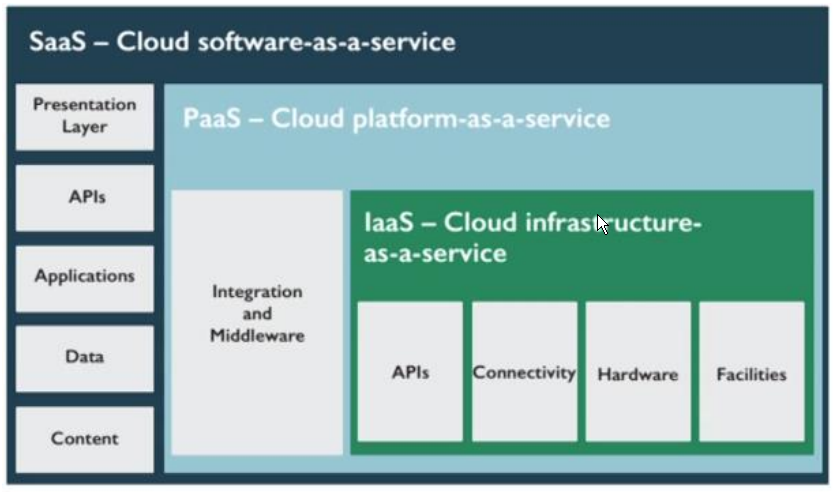
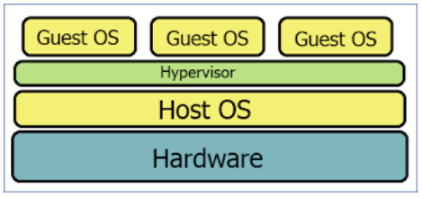
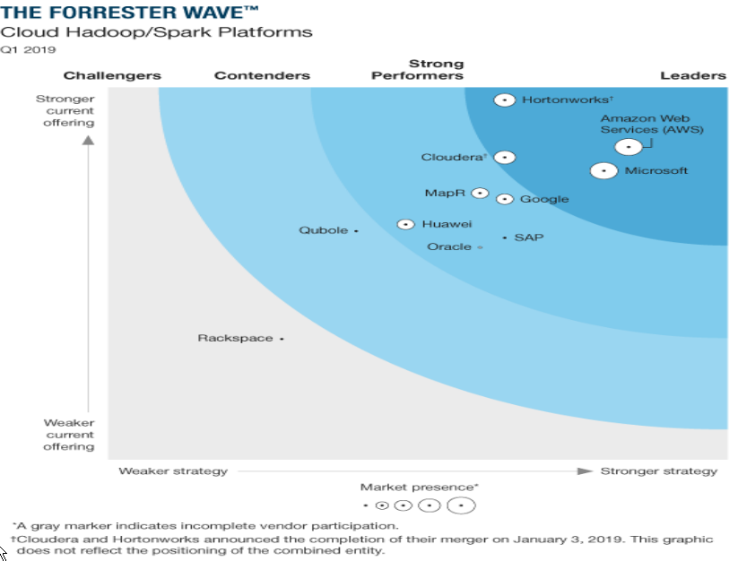
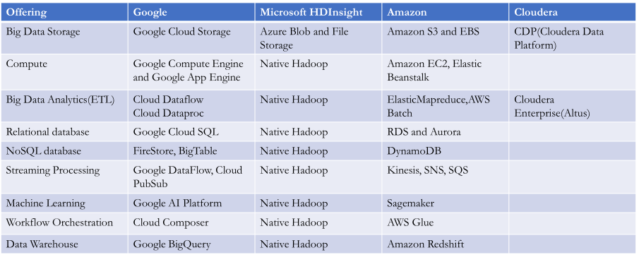

# Big Data Engineering
Garth Mortensen

## Cloud Architecture

What is cloud compute?

> "Cloud computing is a model for enabling ubiquitous, convenient, on-demand network access to a shared pool of configurable computing resources(e.g., networks, servers, storage, applications and services) that can be rapidly provisioned and released with minimal management effort or service provider interaction." (Version 800-145)
>
> NIST Cloud Computing Definition:

EMR clusters are servers. Networks are the diff security groups. Storage is S3 buckets. There's linux, windows, diff applications, etc. There are many models. On-demand, meaning anyone with a credit card. You never have to touch the hardware. 

Cloud is a consumption based service, like electricity. You don't own the power plant. You pay a monthly bill based on how much you use. 

### Cloud infrastructure

Might have a mainframe in a bank. This is coming back in big organizations, why rent when you have enough demand? Fortune 500 have a mix of data center, on premise, but also heavy cloud usage. Now small companies can have large compute of their own though. 

In cloud, you shut down your app, you're not using compute, so you have rapid elastic demand. No continued cost.

What does serverless mean? From a dev perspective, you don't have to worry about it. It's usually container organization, probably running kubernetes. The dev just hands over a snippet of code, or the docker container. Amazon will spin up the container (there's a little overhead to spin it up). Then the code is triggered to run, and Amazon spins it up. Once it's not in demand, it's shut down.

You can deploy Openstack, Azurestack, AWS on premise. 

### Capex vs Opex

#### Capital expenditure

CapEx usually refers to large upfront expenses incurred before commencing use of a product, such as building a data center or acquiring hardware such as servers and racks and procuring Internet connectivity.

For data center, you need to find land, have a building, hire electricians, connect wires, hire engineers, etc.

#### Operational expenditure

OpEx refers to the associated operational expenses after a product is purchased and during its lifetime, such as manpower, utilities, and maintenance

The cloud provider has handled all CapEx and achieved economies of scale.

### Cloud Offerings

Responsibility to support and maintain it transitions from user to provider, as you descend this list.

#### Infrastructure as a Service (IaaS)

Think deploying VMs. Choose an OS. Usage is metered. You can scale up and down, make EC2s bigger and smaller, you can scale out. You pay for network IO, compute, memory, storage.

#### Platform as a Service (PaaS)

Think Databricks. Dev platform you use to build apps. No worry about infrastructure or OS, just code.

OS managed by provider. They patch, they manage everything. Less expensive than hosting on premise.

#### Software as a Service (SaaS)

Think Canvas. You don't need to do anything to make it work. Vendor entirely manages it. Office 365, google sheets. APIs even. Auto updates and patch management, ease of use/admin, global accessibility, global standardization and compatibility.

### Private vs Public clouds

Public clouds = large-scale datacenters available to everyone from large corporations to individual students. In this case, cloud infrastructure is owned by the cloud provider (Google, Amazon, Microsoft, IBM). Cloud customers utilize the same cloud resources, which are shared in a multi-tenant environment.

Private clouds = cloud datacenters owned by private companies. Cloud resources are dedicated to a single organization and typically not accessible from the public internet. Likely isolated behind DMZ, backend services hidden. Used by one organization. UHG might have their own cloud, for instance.

Hybrid = you might have an internal data center, and connect your data to a cloud service provider to use compute, perhaps.

### Virtualization

A huge enabler of of cloud computing as well as gaining efficiencies in private data centers is virtualization right.
that's the ability to take resources on your your hardware like cpu like Ram like network and provide a 

Typically what you have is a fairly large server that you might want to run a bunch of small processes on. So you install an operating system "hypervisor". If on Windows pro, you use hypervisor V. Essentially, they're built to manage and provide isolation between virtual machines.

Virtual machines are allocated virtual resources, but they make better use of the underlying hardware because of the portability. If you need more capacity for one application, you can grow into the available capacity, if you need to shut something down, you can do it very quickly and and get it up and running again.

It's not a new concept - the ability to virtualize compute resources. It dates back to the 70s and 80s.

Virtual memory has been around for a while in operating systems to provide process isolation from a security perspective, and be sure that one process isn't able to get into the memory space of another process. You let processes address only their their addressable space in memory and again chunk out other sections of memory for other processes.

The portability aspect is a benefit as well being able to transfer a vm in case of underlying hardware failures.

Again, historically vms provide great isolation in a multi tenant environment between cloud consumers (so you can potentially be running a vm on the same server is as some other company running their vm without being able to access any of the sensitive data or code running on that other vm).

You can more quickly provision resources, you can easily port applications to other machines and in case of failure. The vm can be any operating system. A hypervisor can run Linux or Windows.

Other some benefits of scale that you get with cloud computing. In this case we're looking at at memory duplication.

The idea here is that you have large tracks of memory that are going to be similar between different vm running on the physical hardware. The hypervisor smart enough to notice this and say "Hey i've duplicated essentially seven identical tracks of memory being used by seven different applications. I'm going to consolidate that into one track of memory, so all these vm can reference them the same physical memory. Until like a write is initiated (or until it becomes "dirty"), until the state of that changes, you can essentially share that memory between running vms.

It's more efficient utilization of memory, which tends to be expensive.

### Hypervisors

you have the underlying hardware, you have a host operating system typically Linux or unix.

You have a hypervisor On top of that running...vmware, hyper V, virtualbox. 

Then you have all those guest operating systems running on top of the hypervisor. Even if the host os is Windows, your guests OS might be Linux or windows.

Hypervisors monitor the traffic and allocate resources for the vms. It shares the host's hardware across all guest vm.

The network is shared, so the hypervisor has to decide where the traffic goes.

It's responsible for isolating. You want a security boundary around each of these virtual machines. The hypervisor doesn't necessarily know that these guest operating systems can be trusted.

#### Type 1

Bare metal hypervisor.

Runs directly on the host hardware, and is also known as a native, embedded, or bare metal...There isn't necessarily an operating system underneath it.

#### Type 2

You also have software based hypervisor is running on top of a host operating system. It works as a virtual machine manager...like Oracle virtual box you're able to create Linux or windows virtual machines within Oracle virtual box, and run them on your device.

Oracle virtualbox hypervisor and vmware fusion are good examples. These are things you might run on your desktop to help with development very common thing to do, for developers.

### Containerization

It's similar to a vm in that it's an isolated environment, and it provides a layer of abstraction between the container running on the machine and the underlying hardware resources being used by the container.

One of the benefits of the Linux kernel is it's modularity. You have the base kernel and you can add all these modules on. You can think of containers. Really you're providing a container for an application to run...whether it's a service, a web application, any any generic service you need to run on a computer, containerize it. You can select the base kernel that you want to use (a base Linux kernel or windows kernel). Then you can start adding the software/libraries/drivers you need to that container, and you define it then as sort of a container file...like a docker file. 

Essentially, you define a container in yaml or json.

Define all the dependencies, the sort of setup processes you need to run for the container, so that it's portable. You can simply deploy it and run it and your application is going to start up with everything it needs to execute.

They're very lightweight in that respect. You don't need a fully fledged OS like you would in a vm. They're typically lighter weight than vms. 

If you have a kubernetes cluster running, for instance, that will typically be running on vms, and then containerization offers an additional layer of abstraction. Containers running on guest OS.

And that's great, because they're just quicker to deploy. You have a vm already up and running, you just throw a container on it.

They do allow you to achieve isolation within a guest operating system.

We used docker before we started using emr. We also used the docker container for NiFi. 

### Trends

There's some trends in cloud computing...serverless expanding beyond just functions, 

You have a db. You can serialize all the data when not in use, so that you can separate the storage from the compute. You don't need a database up and running all the time if nobody's querying it. 

Low code platforms also help.

Serverless is kind of low code. You don't write a lot of code for a function. 

Think PowerApps on the on the Azure side. Things like Wordpress could be considered low code...another website called duda...

There's different offerings for large data warehouses and data lakes either built on top of hadoop or cloud storage or various platforms.

We see specifically for big data trend towards leveraging cloud storage, rather than the hadoop distributed file system. This is simply because of the inexpensive nature of cloud storage. If you have hdfs up and running, that means you have a data nodes up and running, that means you're being charged for compute. If you let the cloud provider manage the compute side of things, you're just writing to cheap storage. Then you don't need to pay for the infrastructure for the compute all the time.

There's more acronyms coming out. You see Integration Platform as a service, Database as a service, Data warehouse as a service, back end as a service.

All PaaS offerrings.

Serverless covers a wide range of technologies. Typically you're thinking about functions. Backend as a service also qualifies as as serverless.

Backend as a service is just kind of more for web Apps, kind of the "fire based", or event based.

### Function as a service (FaaS) or Serverless Compute

We've covered serverless in a good amount of detail.

They're event-based, so they're listening for a specific event to happen. When they happen, they deploy the function, typically as a container.

http events...Q events...timer events...storage events... You can trigger compute when somebody writes to storage. You can trigger compute on a schedule, you can have a web service and when somebody makes a web service call to your API the cloud provider can deploy the backend code to process that request.

Once the function is finished the platform tears down the container vm on the back end. It might leave it up and running for a little bit and then after a period of inactivity shut it down.

There's a lot of optimization that happens on the backend. If there's a lot of extra capacity, they might leave it up longer, if the system is under load they might shut it down sooner.

It's all transparent to the developer, but you might see some requests taking longer just because of the the warm up time for those containers.

You don't have to worry about managing a server holster process using serverless. Event driven model cost is based on usage, typically memory consumption.

#### Limitations of serverless

It's difficult to manage state. You don't want to be writing or reading state in a function.

Usually it's just, you have the request, you give the response, and it's the same response every time, given the same request. You don't need to go to any external systems to the process that request.

Latency can be slightly higher than if you're on dedicated hardware.

You lose control as far as performance tuning and configuration, to some extent.

#### Storage in the cloud

Object storage, containers or buckets.

They might be large if they're an attached disk or something...4 or 5 terabytes is typically the max. That's for a flat container. 

If you want a hierarchical directory style, like file store, you can do that too.

The files could be anything. Data file for a db, attached storage for vm, content for a content delivery network.

It's important to note that most storage providers now offer an hdfs interface, so you can even use cloud storage as the backend storage for your hdfs cluster.

Again, instead of using Linux attached storage, you're actually running the cloud storage.

Azure Blob Storage: ~$20/tb/month
Azure S3 Standard: ~$25/tb/month, Infrequent access: ~$13/tb/month
Google Cloud Storage: Standard: ~$27/tb/month, Nearline: ~$11/tb/month

#### Serverless vs PaaS

PaaS is like databricks. PaaS isn't quite as scalable as serverless. If you're on a server vs serverless, you're not going to be quite as scalable. It's typically limited support and it takes a good amount of time.

### Trends in Big Data

So what are these trends mean for big data?

You see fewer and fewer traditional hadoop clusters hosted on premises as people move to the cloud.

You see compute being decoupled from storage. In hadoop, one of the methodology they used was to try to keep the compute closer to the data. If you need to read data, you go directly to the Linux node where that data resides and you ask for the data.

That means that you have to have your storage and your compute on all the time, but you see trends towards decoupling storage and compute. Compute is expensive, storage is cheap.

You need to have that data persistence somewhere. You can't overwrite it. That's why there's no concept in the cloud of turning storage on or off it's always there. Because again it's persistent. Compute, on the other hand is not persistent. You can turn that on and off at will, save yourself some money. And again, compute tends to be more expensive than in storage, so it's a good thing to decouple them.

#### HARK

bc hadoop and spark are so core for data storage and data processing in hadoop, they're a platform classification and their own right.

They all offer HARK platforms.

There are big data options on cloud environments.

/	/